# N8N Market AI — Workflow Store

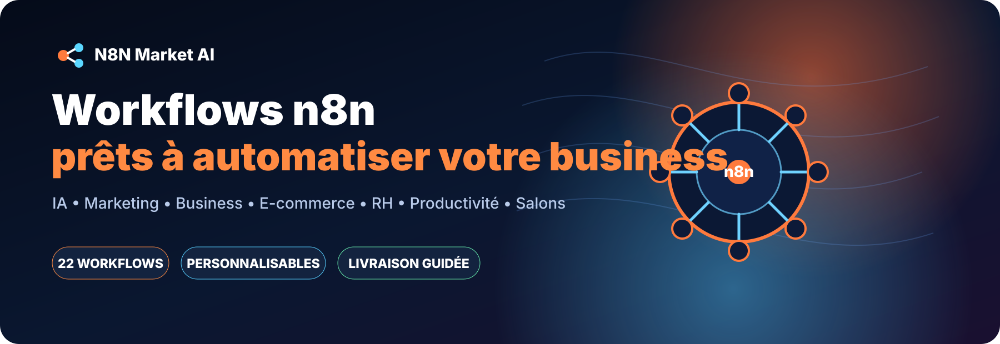

**Automatisez les tâches répétitives avec des workflows n8n professionnels, documentés et personnalisables.**

[🌐 Visiter N8N Market AI](https://n8nmarketai.com/) · [🚀 Voir les workflows prêts à livrer](#-prêts-à-livrer) · [📦 Parcourir les 24 workflows](#-catalogue-complet)

---

## Pourquoi N8N Market AI ?

- **Automatisation concrète** : marketing, ventes, e-commerce, RH, productivité et salons.
- **Installation guidée** : documentation de configuration et paramètres à personnaliser.
- **Personnalisation possible** : adaptation aux outils, données, règles métier et canaux du client.
- **Sécurité** : aucun mot de passe, token ou credential client n'est publié dans GitHub.
- **Livraison commerciale privée** : les fichiers JSON complets payants ne sont pas exposés publiquement.
- **Test gratuit** : un workflow découverte à 0 € permet d’évaluer N8N Market AI avant d’acheter.

## Statuts

| Statut | Signification |
|---|---|
| ✅ **LIVRABLE** | Workflow validé et préparé pour livraison commerciale. |
| 🟢 **PUBLIABLE** | Fiche et structure prêtes ; contrôle final recommandé avant livraison. |
| 🆓 **GRATUIT / DÉCOUVERTE** | Workflow proposé à 0 € pour tester la qualité du service. |
| 🟠 **BETA / PERSONNALISATION** | Workflow visible au catalogue, à finaliser ou adapter avant livraison au client. |

---

## 🚀 Prêts à livrer

<table>
<tr>
<td width="50%" valign="top">
<a href="agents-ia/directeur-marketing-ventes/">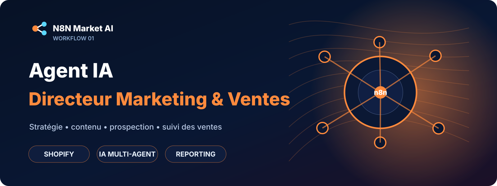</a> 
<strong>Agent IA Directeur Marketing & Ventes</strong> 
✅ LIVRABLE · Shopify · stratégie · contenu · ventes 
<a href="agents-ia/directeur-marketing-ventes/">Voir la fiche →</a>
</td>
<td width="50%" valign="top">
<a href="agents-ia/prospection-ia/">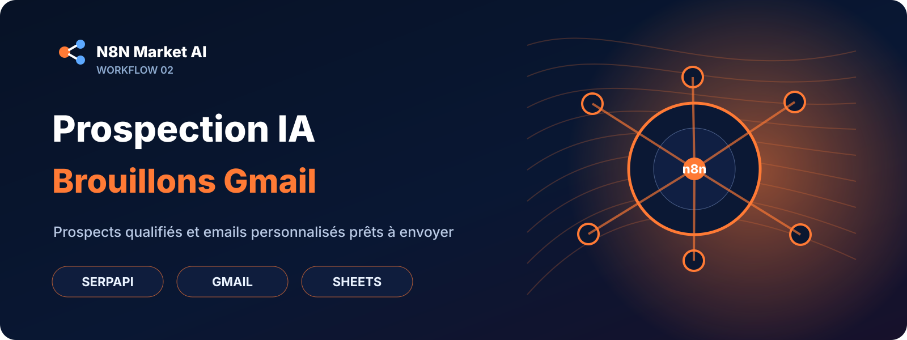</a> 
<strong>Prospection IA — Brouillons Gmail</strong> 
✅ LIVRABLE · prospects · qualification · Gmail · Sheets 
<a href="agents-ia/prospection-ia/">Voir la fiche →</a>
</td>
</tr>
<tr>
<td width="50%" valign="top">
<a href="marketing/facebook-meteo-ia/">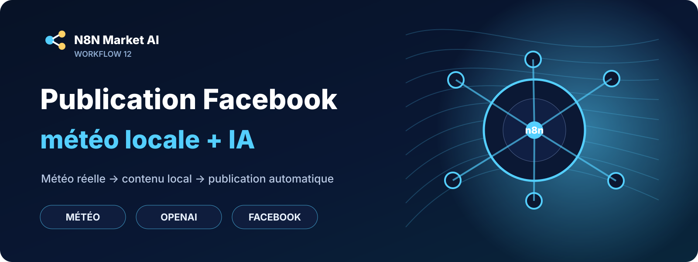</a> 
<strong>Publication Facebook météo locale + IA</strong> 
✅ LIVRABLE · météo locale · contenu IA · Facebook 
<a href="marketing/facebook-meteo-ia/">Voir la fiche →</a>
</td>
<td width="50%" valign="top">
 
<strong>Facebook Posts + Reels — image + vidéo</strong> 
✅ LIVRABLE · posts · images · vidéos · Reels 
<a href="marketing/facebook-posts-reels/">Voir la fiche →</a>
</td>
</tr>
<tr>
<td width="50%" valign="top">
<a href="ecommerce/alerte-rupture-stock-google-sheets/">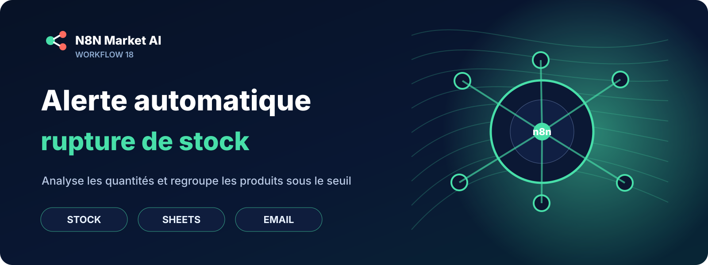</a> 
<strong>Alerte automatique rupture de stock Google Sheets</strong> 
🆓 GRATUIT · 🟢 PUBLIABLE · stock · Sheets · email 
<a href="ecommerce/alerte-rupture-stock-google-sheets/">Voir la fiche →</a>
</td>
<td width="50%" valign="top">
<a href="agents-ia/multi-llm-router/">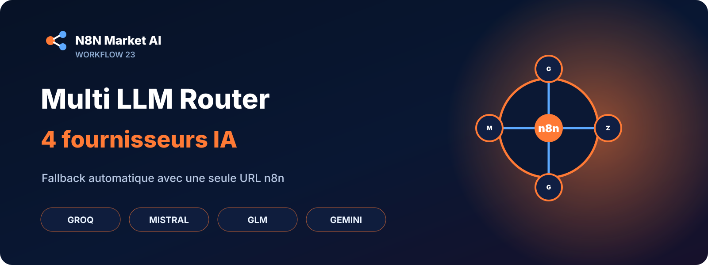</a> 
<strong>Multi LLM Router — Groq + Mistral + GLM + Gemini</strong> 
✅ LIVRABLE · n8n · LLM · fallback · API 
<a href="agents-ia/multi-llm-router/">Voir la fiche →</a>
</td>
</tr>
</table>

---

## 📦 Catalogue complet

### 🤖 Agents IA — Marketing & Ventes

<table>
<tr>
<td width="50%" valign="top">
 
<strong>Agent IA Directeur Marketing & Ventes</strong> 
✅ LIVRABLE <a href="agents-ia/directeur-marketing-ventes/">Voir la fiche →</a>
</td>
<td width="50%" valign="top">
 
<strong>Prospection IA — Brouillons Gmail</strong> 
✅ LIVRABLE <a href="agents-ia/prospection-ia/">Voir la fiche →</a>
</td>
</tr>
<tr>
<td width="50%" valign="top">
<a href="agents-ia/seo-fiches-produits/">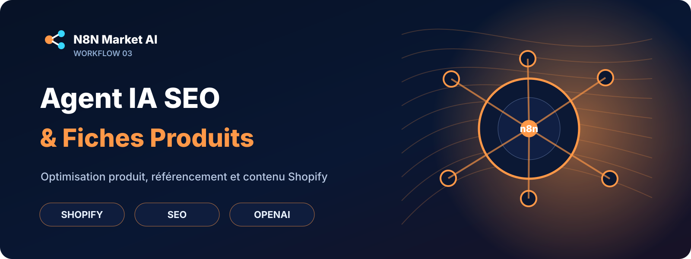</a> 
<strong>Agent IA SEO & Fiches Produits</strong> 
🟠 BETA / personnalisation <a href="agents-ia/seo-fiches-produits/">Voir la fiche →</a>
</td>
<td width="50%" valign="top">
<a href="agents-ia/conversion-relance-clients/">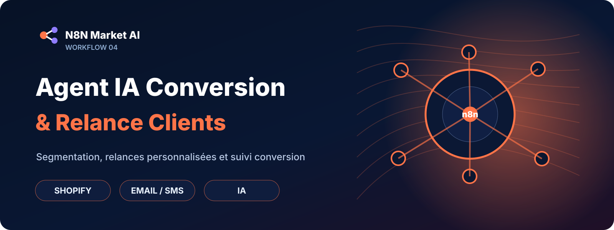</a> 
<strong>Agent IA Conversion & Relance Clients</strong> 
🟠 BETA / personnalisation <a href="agents-ia/conversion-relance-clients/">Voir la fiche →</a>
</td>
</tr>
<tr>
<td width="50%" valign="top">
 
<strong>Multi LLM Router — Groq + Mistral + GLM + Gemini</strong> 
✅ LIVRABLE · 29 € · fallback multi-LLM <a href="agents-ia/multi-llm-router/">Voir la fiche →</a>
</td>
<td width="50%" valign="top">
<strong>Routeur IA résilient</strong>  
Une seule URL n8n pour basculer automatiquement entre Groq, Mistral, GLM/Z.AI et Gemini.
</td>
</tr>
</table>

### 💼 Business

<table>
<tr>
<td width="50%" valign="top">
<a href="business/fiche-client-google-sheets-slack/">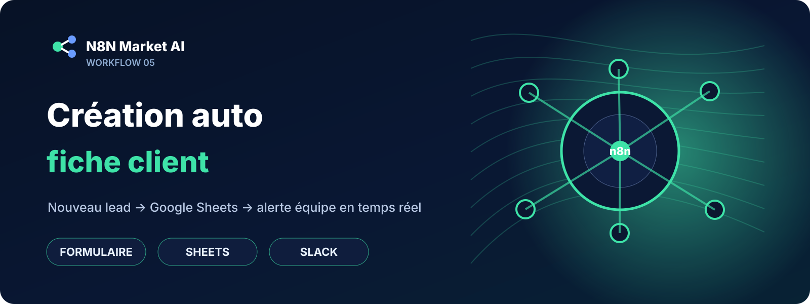</a> 
<strong>Création auto fiche client Google Sheets + alerte Slack</strong> 
🟠 BETA / personnalisation <a href="business/fiche-client-google-sheets-slack/">Voir la fiche →</a>
</td>
<td width="50%" valign="top">
 
<strong>Qualification automatique des leads par email</strong> 
🟠 BETA / personnalisation <a href="business/qualification-leads-email/">Voir la fiche →</a>
</td>
</tr>
<tr>
<td width="50%" valign="top">
<a href="business/rappel-factures-impayees/">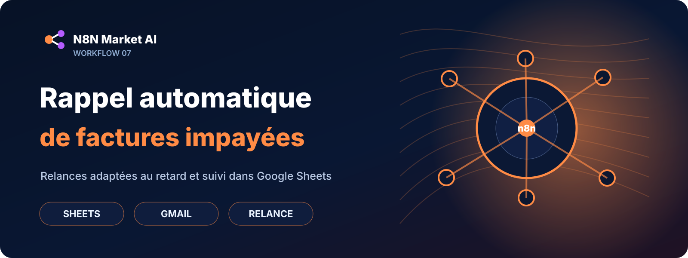</a> 
<strong>Rappel automatique de factures impayées par email</strong> 
🟠 BETA / personnalisation <a href="business/rappel-factures-impayees/">Voir la fiche →</a>
</td>
<td width="50%" valign="top">
<a href="business/sauvegarde-factures-devis-google-drive/">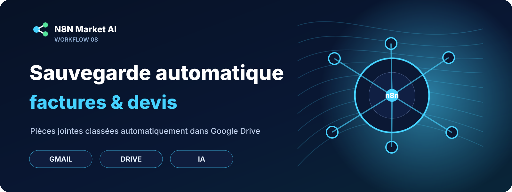</a> 
<strong>Sauvegarde automatique factures et devis vers Google Drive</strong> 
🟠 BETA / personnalisation <a href="business/sauvegarde-factures-devis-google-drive/">Voir la fiche →</a>
</td>
</tr>
</table>

### ⚡ Productivité

<table>
<tr>
<td width="50%" valign="top">
<a href="productivity/appels-offres-ia-email/">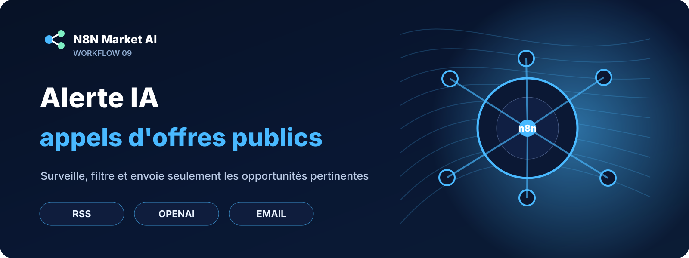</a> 
<strong>Alerte IA appels d'offres publics par email</strong> 
🟠 BETA / personnalisation <a href="productivity/appels-offres-ia-email/">Voir la fiche →</a>
</td>
<td width="50%" valign="top">
 
<strong>Compte-rendu Zoom vers Notion avec prompt personnalisé</strong> 
🟠 BETA / personnalisation <a href="productivity/zoom-notion-prompt/">Voir la fiche →</a>
</td>
</tr>
</table>

### 📣 Marketing

<table>
<tr>
<td width="50%" valign="top">
<a href="marketing/collecte-avis-clients/">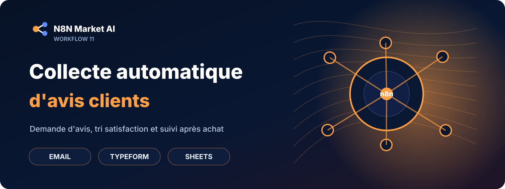</a> 
<strong>Collecte automatique d'avis clients après achat</strong> 
🟠 BETA / personnalisation <a href="marketing/collecte-avis-clients/">Voir la fiche →</a>
</td>
<td width="50%" valign="top">
 
<strong>Publication Facebook auto météo locale + IA</strong> 
✅ LIVRABLE <a href="marketing/facebook-meteo-ia/">Voir la fiche →</a>
</td>
</tr>
<tr>
<td width="50%" valign="top">
 
<strong>Facebook Posts + Reels — image + vidéo</strong> 
✅ LIVRABLE <a href="marketing/facebook-posts-reels/">Voir la fiche →</a>
</td>
<td width="50%" valign="top">
<a href="marketing/linkedin-google-sheets/">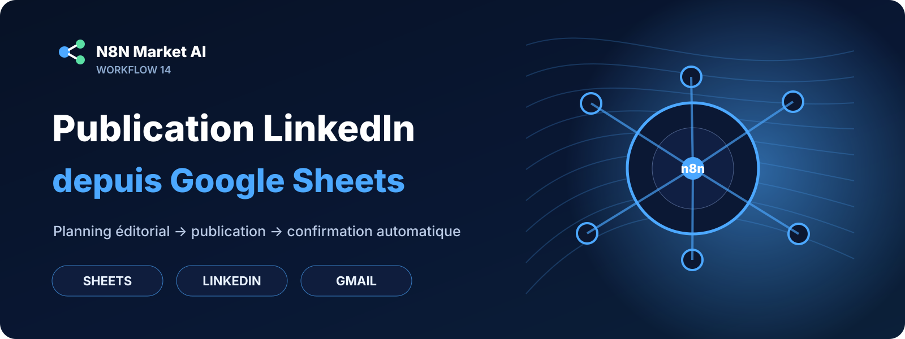</a> 
<strong>Publication automatique LinkedIn depuis Google Sheets</strong> 
🟠 BETA / personnalisation <a href="marketing/linkedin-google-sheets/">Voir la fiche →</a>
</td>
</tr>
<tr>
<td width="50%" valign="top">
<a href="marketing/reponse-avis-google-business/">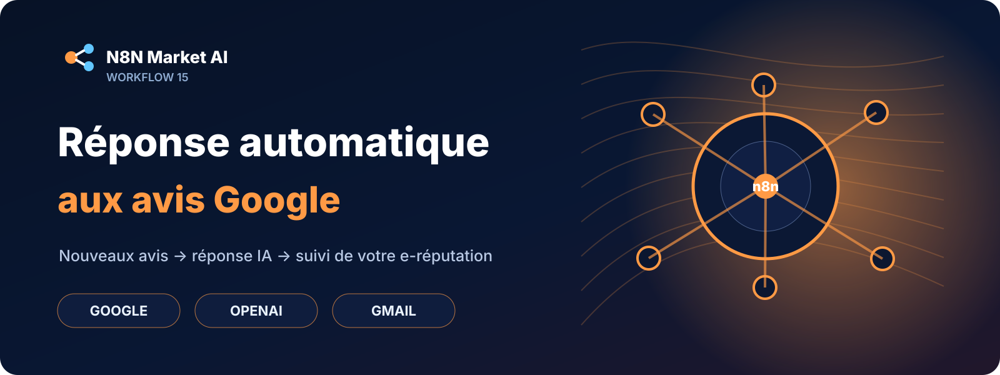</a> 
<strong>Réponse automatique aux avis Google Business</strong> 
🟠 BETA / personnalisation <a href="marketing/reponse-avis-google-business/">Voir la fiche →</a>
</td>
<td width="50%" valign="top">
<a href="marketing/veille-marque-twitter-google-sheets/">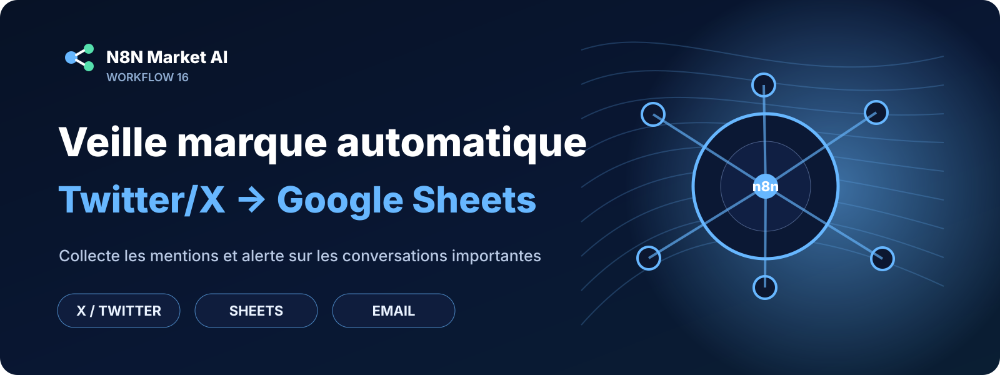</a> 
<strong>Veille marque automatique Twitter/X vers Google Sheets</strong> 
🟠 BETA / personnalisation <a href="marketing/veille-marque-twitter-google-sheets/">Voir la fiche →</a>
</td>
</tr>
<tr>
<td width="50%" valign="top">
<a href="marketing/prospection-tiktok-luxembourg/">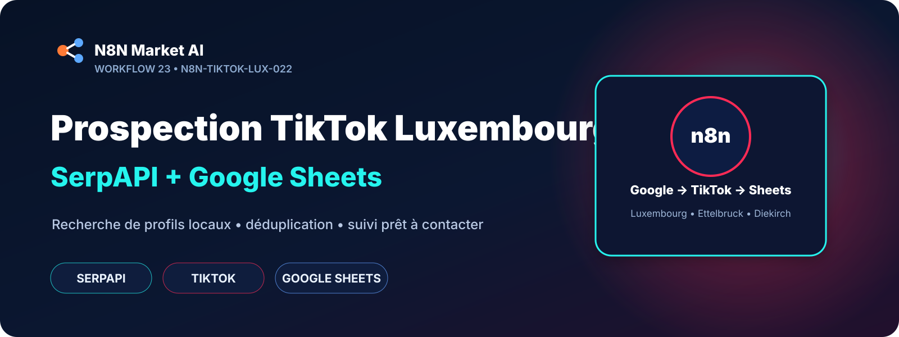</a> 
<strong>Prospection TikTok Luxembourg — SerpAPI + Google Sheets</strong> 
🟢 PUBLIABLE · 9,99 € · TikTok · SerpAPI · Sheets <a href="marketing/prospection-tiktok-luxembourg/">Voir la fiche →</a>
</td>
<td width="50%" valign="top">
<strong>Nouveau workflow prospection locale</strong>  
Recherche de profils TikTok via Google/SerpAPI avec déduplication et suivi Google Sheets.
</td>
</tr>
</table>

### 🛒 E-commerce

<table>
<tr>
<td width="50%" valign="top">
<a href="ecommerce/alerte-baisse-prix-amazon/">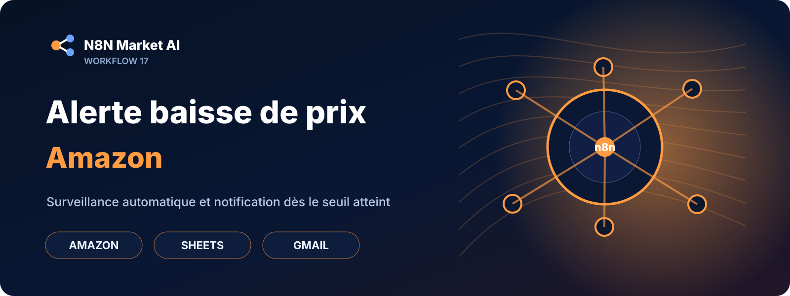</a> 
<strong>Alerte email automatique baisse de prix Amazon</strong> 
🟠 BETA / personnalisation <a href="ecommerce/alerte-baisse-prix-amazon/">Voir la fiche →</a>
</td>
<td width="50%" valign="top">
 
<strong>Alerte automatique rupture de stock Google Sheets</strong> 
🆓 GRATUIT · 🟢 PUBLIABLE <a href="ecommerce/alerte-rupture-stock-google-sheets/">Tester gratuitement →</a>
</td>
</tr>
</table>

### 👥 RH

<table>
<tr>
<td width="50%" valign="top">
<a href="rh/accuse-reception-candidature/">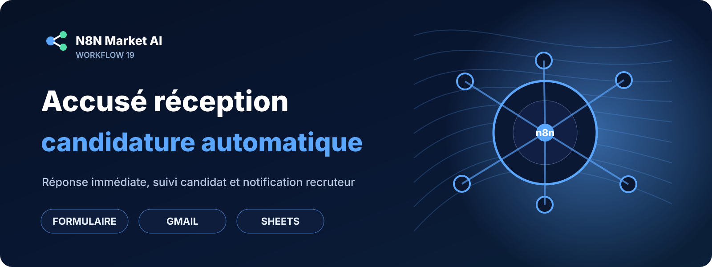</a> 
<strong>Accusé réception automatique candidature formulaire</strong> 
🟠 BETA / personnalisation <a href="rh/accuse-reception-candidature/">Voir la fiche →</a>
</td>
<td width="50%" valign="top">
<a href="rh/tri-cv-email-notion/">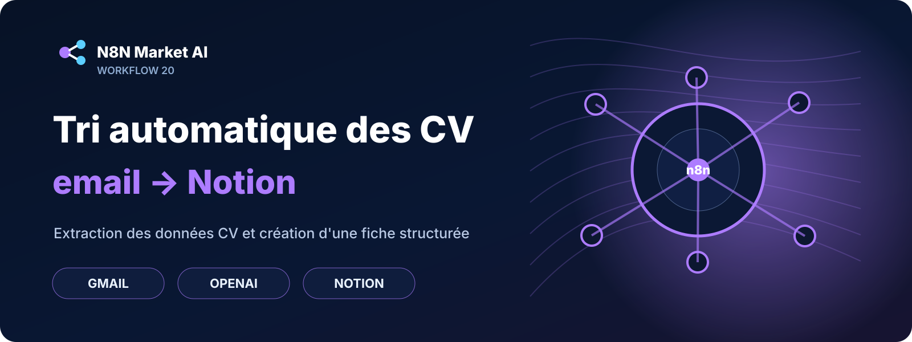</a> 
<strong>Tri automatique des CV par email vers Notion</strong> 
🟠 BETA · 3 variantes regroupées <a href="rh/tri-cv-email-notion/">Voir la fiche →</a>
</td>
</tr>
</table>

### ✂️ Salons — workflows indépendants

<table>
<tr>
<td width="50%" valign="top">
<a href="salon/confirmation-rdv-sms/">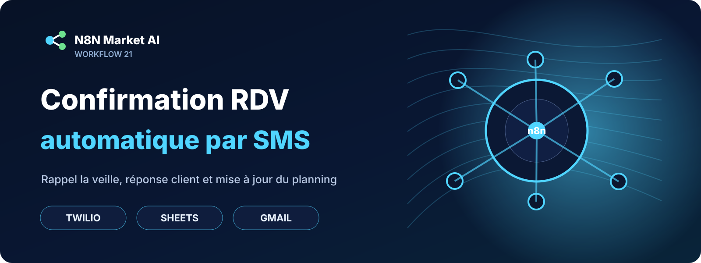</a> 
<strong>Confirmation RDV automatique par SMS</strong> 
🟠 BETA / personnalisation <a href="salon/confirmation-rdv-sms/">Voir la fiche →</a>
</td>
<td width="50%" valign="top">
 
<strong>Relance SMS automatique clients inactifs 90 jours</strong> 
🟠 BETA / personnalisation <a href="salon/relance-clients-inactifs-90j/">Voir la fiche →</a>
</td>
</tr>
</table>

---

## 📦 Ce que le client reçoit

Selon le produit et son niveau de validation, la livraison peut comprendre :

- le fichier **workflow n8n importable `.json`** ;
- un **guide d'installation** ;
- la liste des **credentials et API à connecter** ;
- les paramètres à personnaliser ;
- les modèles Google Sheets / structures nécessaires lorsqu'ils sont prévus ;
- une adaptation aux besoins du client pour les workflows vendus en version personnalisée.

> Les credentials, clés API, tokens OAuth et mots de passe restent toujours configurés dans l'environnement du client.

## 🔧 Comment ça fonctionne ?

**1. Choisir** un workflow dans le catalogue.  
**2. Consulter** sa fiche détaillée, ses prérequis et ses limites.  
**3. Commander ou demander une personnalisation** via N8N Market AI.  
**4. Configurer** les comptes et credentials nécessaires.  
**5. Tester et valider** le workflow dans l'environnement du client.  
**6. Livrer** la version finale et sa documentation.

## 🔒 Sécurité du dépôt

Ce dépôt sert de **catalogue et documentation**.

Les versions commerciales complètes ne doivent jamais exposer publiquement :

- clés API ;
- mots de passe ;
- tokens OAuth ;
- IDs sensibles propres à un client ;
- credentials n8n ;
- données clients ;
- fichiers JSON commerciaux complets lorsque leur diffusion est réservée aux acheteurs.

---

## N8N Market AI

**24 workflows documentés** couvrant l'IA, le marketing, les ventes, le business, l'e-commerce, la productivité, les RH et les salons.

👉 [**Découvrir la boutique N8N Market AI**](https://n8nmarketai.com/)

**Plateforme d'automatisation :** n8n  
**Projet :** Workflow Store