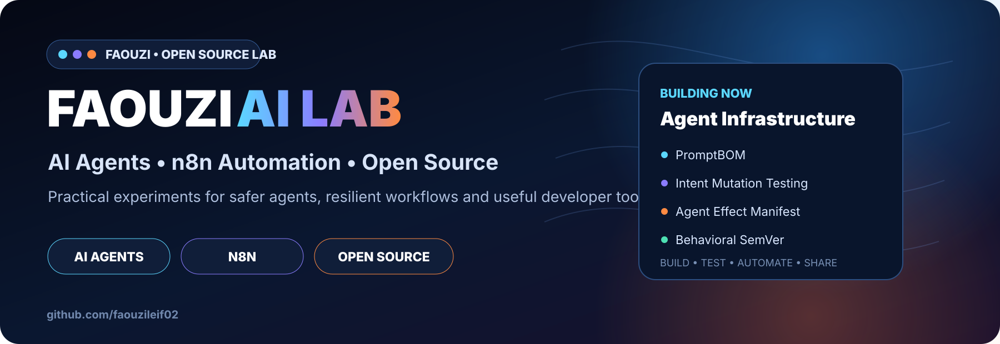

# FAOUZI AI LAB



<div align="center">

**AI Agents • n8n Automation • Open Source**

Practical experiments for safer AI agents, resilient automations and useful developer tools.

[🚀 Start Here](START_HERE.md) · [🤖 AI Agents](agents-ia/) · [⚡ n8n Workflows](N8N_CATALOG.md) · [🧪 Roadmap](ROADMAP.md) · [🤝 Contribute](CONTRIBUTING.md)

</div>

---

## What is FAOUZI AI LAB?

FAOUZI AI LAB is an open-source workspace focused on **AI-agent infrastructure, n8n automation and practical experiments**.

The goal is not to publish another collection of chatbot demos. The focus is on building systems that are easier to **test, audit, control, reuse and understand**.

### Core themes

| Area | Focus |
|---|---|
| 🤖 **AI Agents** | Agent safety, evaluation, behavioral testing, permissions and orchestration |
| ⚡ **n8n** | Practical workflows, multi-LLM routing, business automation and integrations |
| 🔓 **Open Source** | Reusable specifications, developer tools, documentation and experiments |
| 🧪 **Research → MVP** | Turn interesting concepts into small, testable public projects |

---

# ⭐ Featured projects

## 1. FAOUZI AI LAB — Agent Infrastructure

A collection of experimental concepts designed around the problems that appear when agents become more autonomous.

**Current concepts:**

- **PromptBOM** — SBOM-style inventory of everything an AI agent was told.
- **Agent Effect Manifest** — predict tool side effects before execution and compare them with what really happened.
- **Intent Mutation Testing** — test one user intent across languages, paraphrases, typos and reordered constraints.
- **Behavioral SemVer** — classify agent releases as PATCH / MINOR / MAJOR from measured behavior.
- **Approval Debt** — detect repetitive human approvals that may be candidates for carefully scoped automation.
- **Intent Lockfile** — convert non-negotiable user constraints into deterministic runtime rules.
- **Purpose-Bound Capability Lease** — permissions become invalid when the purpose of the task changes.
- **ModelSwap Replay** — compare model/provider substitutions without replaying dangerous real-world side effects.

➡️ **[Explore FAOUZI AI LAB](agents-ia/faouzi-ai-lab/)**

---

## 2. Multi-LLM Router

A resilient n8n workflow that can route requests across multiple LLM providers and implement fallback behavior.

**Focus:** n8n · LLM APIs · fallback · routing · resilience

➡️ **[Open Multi-LLM Router](agents-ia/multi-llm-router/)**

---

## 3. N8N Market AI Workflow Collection

A practical workflow library covering AI, marketing, business, e-commerce, productivity, HR and service businesses.

**Examples:**

- AI marketing & sales director
- AI prospecting workflows
- Facebook automation
- Google Sheets stock alerts
- Lead qualification
- CV processing
- Customer follow-up
- Salon automation

➡️ **[Browse the n8n catalog](N8N_CATALOG.md)**

---

# 🧠 AI Agents

The `agents-ia/` area contains two complementary types of projects:

### Production-oriented automations

Useful workflows that combine AI with business tools and n8n.

### Experimental agent infrastructure

Research-driven concepts from FAOUZI AI LAB designed to improve:

```text
Safety
  ↓
Intent preservation
  ↓
Permissions
  ↓
Tool execution
  ↓
Observed effects
  ↓
Evaluation
  ↓
Auditability
```

➡️ **[Browse AI Agent projects](agents-ia/)**

---

# ⚡ n8n Automation

This repository contains documented workflow ideas and implementations grouped by domain:

| Category | Examples |
|---|---|
| 🤖 AI | multi-LLM routing, prospecting, SEO, agent workflows |
| 💼 Business | lead qualification, invoice reminders, document backup |
| 📣 Marketing | Facebook, LinkedIn, reviews, monitoring, local prospecting |
| 🛒 E-commerce | stock alerts, price monitoring |
| 👥 HR | application acknowledgement, CV processing |
| ✂️ Services | appointment confirmation, customer reactivation |
| ⚡ Productivity | reporting, Notion, alerts |

➡️ **[Open the workflow catalog](N8N_CATALOG.md)**

---

# 🔓 Open Source Principles

Projects published here should aim to be:

- **Understandable** — README before complexity.
- **Testable** — a useful demo should be easy to run.
- **Safe by default** — never publish credentials, secrets or client data.
- **Modular** — reusable components are preferred over giant opaque systems.
- **Honest about maturity** — concept, prototype, beta and stable are clearly distinguished.
- **Useful without hype** — every project should solve or study a concrete problem.

Read more: **[OPEN_SOURCE.md](OPEN_SOURCE.md)**

---

# 🗺️ Project status

| Project | Stage | Next target |
|---|---:|---|
| PromptBOM | 🟡 Specification | Working local CLI |
| Agent Effect Manifest | 🟡 Specification | Effect schema + simulator |
| Intent Mutation Testing | 🟡 Specification | Deterministic mutation runner |
| Behavioral SemVer | 🟡 Specification | Behavior fingerprint format |
| Multi-LLM Router | 🟢 Usable | More providers + benchmark mode |
| n8n Workflow Library | 🟢 Active | Better examples + testing |

➡️ Full plan: **[ROADMAP.md](ROADMAP.md)**

---

# 🚀 Start in 60 seconds

If you are new here:

1. Open **[START_HERE.md](START_HERE.md)**.
2. Choose **AI Agents**, **n8n**, or **Open Source experiments**.
3. Open a project README.
4. Check its status and prerequisites.
5. Test locally before connecting production credentials.

---

# 🔐 Security

Do **not** commit:

- API keys
- OAuth tokens
- passwords
- n8n credentials
- personal customer data
- private webhook secrets
- paid/private workflow packages intended only for buyers

See **[SECURITY.md](SECURITY.md)**.

---

# 🤝 Contributions

Ideas, implementation proposals, test cases and integrations are welcome.

Especially useful contributions include:

- MCP integrations
- n8n nodes / workflow adapters
- multilingual agent tests
- threat models
- local-model compatibility
- evaluation datasets
- documentation improvements

➡️ **[Contribution guide](CONTRIBUTING.md)**

---

<div align="center">

## FAOUZI AI LAB

**Build • Test • Automate • Share**

`AI Agents` · `n8n` · `Automation` · `Agent Safety` · `LLM Evaluation` · `Open Source`

</div>
