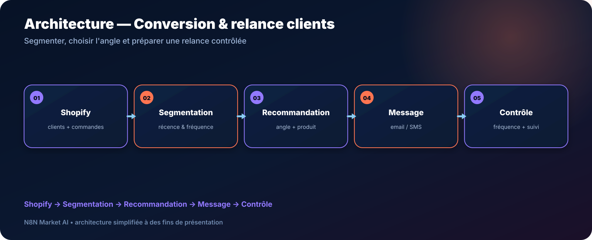

# Agent IA Conversion & Relance Clients Shopify — n8n

> **Un agent IA pour segmenter les clients Shopify, détecter les opportunités de réactivation et préparer des relances personnalisées avec contrôle de fréquence.**

[**🛠️ Commander une version personnalisée — 29 € →**](https://n8nmarketai.com/products/agent-ia-conversion-relance-clients-shopify-n8n)

## 🛒 Offre N8N Market AI

| | |
|---|---|
| 💰 **Prix** | **29 €** |
| 📌 **Statut** | **🟠 BETA / PERSONNALISATION** |
| 📦 **Livraison** | Finalisation + validation avant livraison |
| 🧩 **Niveau** | Intermédiaire |
| ⏱️ **Installation estimée** | 30–60 min* |
| 🔧 **Personnalisation** | Disponible |

*Estimation hors récupération, création ou validation des accès externes.

---

## Pourquoi ce produit ?

Relancer tous les clients de la même manière peut être inefficace et risqué. Ce workflow vise à préparer une approche plus structurée à partir de l’historique disponible.

Il vise à :
- segmenter selon récence et fréquence ;
- repérer les clients inactifs ;
- choisir un angle de relance ;
- recommander un produit pertinent ;
- préparer un message email ou SMS ;
- limiter la fréquence et gérer les exclusions.

## Pour qui ?

- boutiques Shopify ;
- marques e-commerce ;
- équipes CRM légères ;
- agences e-commerce ;
- commerçants souhaitant structurer la réactivation client.

## Avant / Après

| Avant | Avec le workflow |
|---|---|
| Liste client peu exploitée | Segmentation structurée |
| Même message pour tous | Angle personnalisé |
| Relances sans fréquence claire | Contrôle anti-spam |
| Peu de suivi | Journalisation |
| Décision manuelle produit par produit | Recommandation assistée |

## Architecture

**Shopify → Segmentation → Recommandation → Message → Contrôle**

## Fonctionnement cible

1. Lire les clients et commandes utiles.
2. Calculer les segments configurés.
3. Repérer les profils à réactiver.
4. Choisir l’angle et le produit à recommander.
5. Préparer le message.
6. Vérifier exclusions, fréquence et canal avant toute action.

## Cas d'usage

### Clients inactifs
Préparer une campagne de réactivation.

### Réachat
Suggérer une relance selon l’historique.

### Agence
Créer des règles différentes par boutique.

## ⚠️ À finaliser avant livraison

- adapter les segments au modèle commercial du client ;
- valider les règles de fréquence ;
- configurer les listes d’exclusion ;
- tester le canal email/SMS choisi ;
- définir précisément ce qui nécessite validation humaine.

## Limites

- la qualité dépend des données Shopify disponibles ;
- ne doit pas être utilisé sans règles de consentement adaptées ;
- le canal SMS peut nécessiter une configuration dédiée ;
- aucune promesse de conversion n’est garantie.

## 🛡️ Garde-fous recommandés

- liste d’exclusion ;
- limite de fréquence ;
- journalisation ;
- validation humaine possible ;
- aucun envoi si les règles du canal ne sont pas satisfaites.

## 📦 Ce que vous recevez

Après finalisation :
- workflow personnalisé ;
- règles de segmentation ;
- templates de message ;
- configuration fréquence/exclusions ;
- guide Shopify ;
- documentation du canal choisi.

> Le fichier JSON commercial complet, les clés API et les credentials clients ne sont pas publiés dans ce dépôt.

## Prérequis

- n8n ;
- Shopify ;
- credentials Shopify ;
- fournisseur IA ;
- canal email ou SMS compatible.

## FAQ

### Le workflow envoie-t-il automatiquement ?
Cela dépend de la configuration retenue ; une validation humaine peut être imposée.

### Puis-je définir mes propres segments ?
Oui.

### Gère-t-il les exclusions ?
Oui, elles doivent faire partie de la configuration finale.

### Peut-il recommander un produit différent selon le client ?
Oui, si les données nécessaires sont disponibles.

---

## Réactivez vos clients avec des règles plus intelligentes

[**🛠️ Commander la version personnalisée — 29 € →**](https://n8nmarketai.com/products/agent-ia-conversion-relance-clients-shopify-n8n)

[← Retour au catalogue N8N Market AI](../../README.md)
