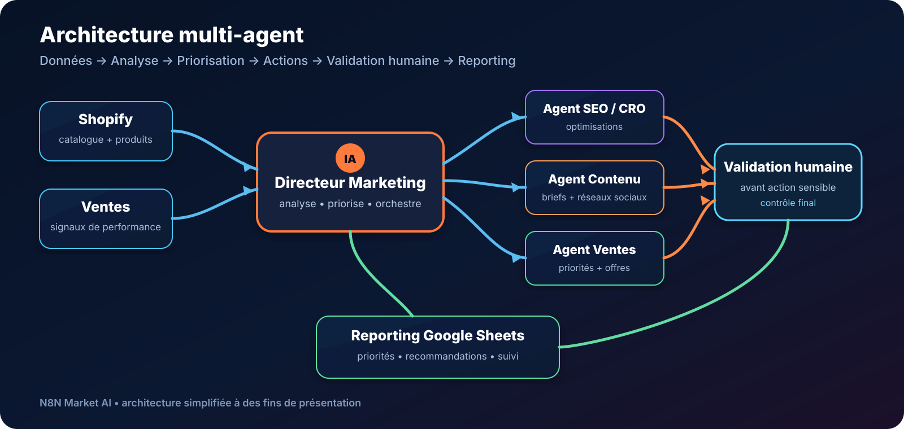

# Agent IA Directeur Marketing & Ventes pour Shopify — Multi-Agent n8n

> **Un directeur marketing IA qui analyse votre catalogue Shopify, identifie les priorités commerciales et prépare des actions marketing, SEO, CRO et contenu — avec validation humaine avant toute action sensible.**

[**🛒 Acheter le workflow — 29 € →**](https://n8nmarketai.com/products/agent-ia-directeur-marketing-ventes-multi-agent-n8n)

## 🛒 Offre N8N Market AI

| | |
|---|---|
| 💰 **Prix** | **29 €** |
| 📌 **Statut** | **✅ LIVRABLE** |
| 📦 **Livraison** | Prêt à livrer après achat |
| 🧩 **Niveau** | Avancé |
| ⏱️ **Installation estimée** | 45–90 min* |
| 🔧 **Personnalisation** | Disponible |
| 🛡️ **Validation humaine** | Intégrée avant les actions sensibles |

*Estimation hors création, validation ou récupération des accès aux services externes.

---

## Pourquoi ce produit ?

Piloter le marketing d'une boutique e-commerce demande de consulter le catalogue, comprendre les performances, décider quels produits mettre en avant, préparer des contenus et suivre les résultats.

Ce workflow centralise cette logique dans un **système multi-agent orchestré par un directeur marketing IA**.

Il aide à :

- réduire le travail manuel d'analyse et de préparation ;
- structurer les priorités marketing ;
- identifier les produits à mettre en avant ;
- accélérer la préparation des briefs ;
- organiser les recommandations SEO et CRO ;
- préparer un plan marketing journalier ou hebdomadaire ;
- centraliser les recommandations et le suivi dans Google Sheets.

> Le workflow assiste la décision. Il ne remplace pas la validation humaine sur les actions sensibles.

## Pour qui ?

Ce workflow est conçu notamment pour :

- boutiques **Shopify** ;
- marques e-commerce ;
- entrepreneurs gérant eux-mêmes leur marketing ;
- petites équipes marketing ;
- agences accompagnant plusieurs boutiques ;
- catalogues comportant suffisamment de produits pour rendre la priorisation manuelle chronophage.

## Avant / Après

| Avant | Avec le workflow |
|---|---|
| Analyse manuelle du catalogue | Analyse structurée des données Shopify |
| Difficulté à choisir quoi promouvoir | Priorités produits clairement proposées |
| Briefs préparés à la main | Briefs marketing générés plus rapidement |
| SEO, CRO et contenu traités séparément | Recommandations regroupées dans un même processus |
| Reporting dispersé | Suivi centralisé dans Google Sheets |
| Risque d'automatiser trop vite | Validation humaine avant les actions sensibles |

## Architecture multi-agent

Le fonctionnement suit une logique simple :

**Données → Analyse → Priorisation → Agents spécialisés → Validation humaine → Reporting**

Le directeur marketing IA sert d'orchestrateur : il interprète les informations disponibles, définit les priorités puis délègue la préparation des recommandations aux fonctions spécialisées.

## Ce que le système peut produire

Selon la configuration retenue, le workflow peut préparer :

- une liste de produits prioritaires ;
- un plan marketing journalier ou hebdomadaire ;
- des recommandations SEO ;
- des pistes d'optimisation CRO ;
- des idées et briefs de contenu ;
- des briefs pour réseaux sociaux ;
- des angles d'email marketing ;
- des recommandations commerciales ;
- un reporting structuré dans Google Sheets ;
- une liste d'actions à valider humainement.

## Fonctionnement

1. **Lecture du catalogue Shopify**  
   Le workflow récupère les informations utiles sur les produits.

2. **Analyse des signaux commerciaux**  
   Les données disponibles servent à construire un contexte de décision.

3. **Priorisation**  
   Le directeur IA identifie les produits et actions à examiner en priorité.

4. **Délégation aux fonctions spécialisées**  
   Les recommandations SEO, CRO, contenu et vente sont préparées selon le besoin.

5. **Validation humaine**  
   Les actions sensibles restent soumises à une validation explicite.

6. **Reporting**  
   Les recommandations et priorités peuvent être centralisées dans Google Sheets.

## Fonctions principales

- lecture du catalogue Shopify ;
- analyse des ventes et signaux de performance disponibles ;
- sélection des produits à mettre en avant ;
- plan marketing journalier / hebdomadaire ;
- recommandations SEO ;
- recommandations CRO ;
- briefs contenu, email et réseaux sociaux ;
- reporting Google Sheets ;
- validation humaine avant action sensible.

## Cas d'usage

### Boutique avec un catalogue important
Le workflow aide à faire ressortir les produits qui méritent une attention marketing prioritaire.

### Petite équipe marketing
Il prépare une partie du travail d'analyse et des briefs afin que l'équipe se concentre sur la validation et l'exécution.

### Préparation d'une semaine marketing
Le système peut structurer les priorités, recommandations et briefs dans un plan exploitable.

### Optimisation continue du catalogue
SEO, CRO, contenu et priorisation commerciale peuvent être examinés dans le même processus.

### Agence e-commerce
Le workflow peut servir de base personnalisable pour structurer l'analyse et les recommandations destinées à différents clients.

## 🛡️ Garde-fous intégrés

La version commerciale est pensée pour conserver un contrôle humain.

- **Aucune modification automatique des prix** ;
- **aucune remise automatique** ;
- **aucun envoi massif sans autorisation** ;
- **validation humaine avant toute action sensible** ;
- **aucune clé API publiée dans GitHub** ;
- credentials configurés directement dans l'environnement n8n du client.

## 📦 Ce que vous recevez

- le workflow n8n importable ;
- le guide d'installation et de configuration ;
- la liste des comptes, API et credentials à connecter ;
- les paramètres à personnaliser ;
- une base prête à adapter à votre environnement.

> Le fichier JSON commercial complet n'est pas publié dans ce dépôt. La version commerciale auditée est conservée séparément et livrée après achat.

## Prérequis

Pour exploiter le workflow, il faut prévoir selon la configuration :

- une instance **n8n** ;
- un accès à la boutique **Shopify** ;
- les credentials nécessaires configurés dans n8n ;
- un fournisseur IA compatible avec la configuration du workflow ;
- **Google Sheets** pour le reporting si cette fonction est utilisée.

Aucun secret client ne doit être enregistré directement dans GitHub.

## FAQ

### Le workflow fonctionne-t-il avec Shopify ?
Oui. Le produit est conçu autour de l'analyse d'un catalogue Shopify et de données commerciales disponibles dans la configuration.

### Peut-il être personnalisé pour ma boutique ?
Oui. Les règles de priorisation, les briefs, les champs utilisés et certaines étapes peuvent être adaptés à l'environnement du client.

### L'IA peut-elle modifier mes prix automatiquement ?
Non dans la configuration commerciale décrite ici. Les modifications de prix et remises automatiques font partie des actions volontairement bloquées.

### Une validation humaine est-elle prévue ?
Oui. Les actions sensibles sont conçues pour rester sous contrôle humain.

### Mes clés API sont-elles publiées avec le workflow ?
Non. Les credentials sont configurés séparément dans n8n et ne doivent pas être stockés dans le dépôt public.

### Comment le workflow est-il livré ?
La version commerciale est livrée sous forme de workflow n8n importable accompagné des informations nécessaires à sa configuration.

### Puis-je l'adapter à mes propres règles marketing ?
Oui. La personnalisation peut porter sur les critères de priorité, la structure des briefs, les sorties et les règles de validation.

---

## Prêt à automatiser votre pilotage marketing ?

Utilisez un système multi-agent pour structurer l'analyse de votre catalogue, préparer vos priorités et accélérer la production de recommandations exploitables.

[**🛒 Acheter Agent IA Directeur Marketing & Ventes — 29 € →**](https://n8nmarketai.com/products/agent-ia-directeur-marketing-ventes-multi-agent-n8n)

[← Retour au catalogue N8N Market AI](../../README.md)
