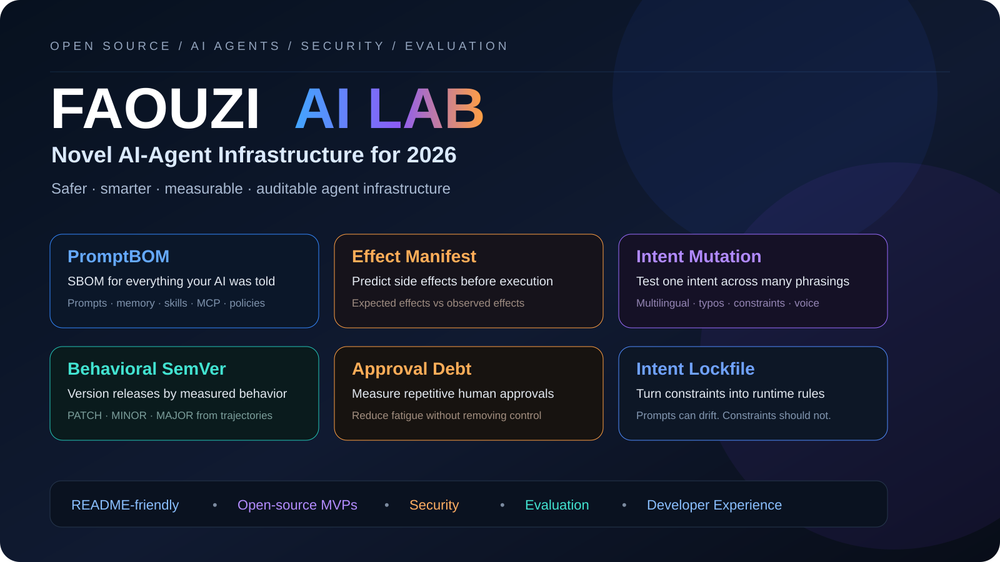

<p align="center"></p>

# FAOUZI AI LAB

**AI Agents • Safety • Evaluation • Open Source**

FAOUZI AI LAB is an open-source workspace for building practical infrastructure around autonomous AI agents: behavioral testing, instruction supply-chain visibility, permissions, runtime constraints, migration risk and auditability.

> **Build agents that do more — while making their behavior easier to understand, test and control.**

---

## 🚀 First functional project: PromptBOM v0.2.0

> **SBOM for everything your AI was told.**

PromptBOM is now a real local-first CLI, not only a specification. It inventories the instruction surface that can influence an agent, fingerprints it with SHA-256 and generates a deterministic lock so behavioral-surface drift becomes reviewable.

### Current capabilities

- `scan`, `show`, `lock`, `verify`
- `diff`, `report`, `validate`, `init`
- Claude / Cursor / GitHub Copilot / Gemini awareness
- MCP, skills, memory, policies and `AGENTS.md`
- secret-location detection without storing secret values
- heuristic authority-conflict detection
- Markdown / standalone HTML reports
- custom scan rules
- symlink safety
- Python 3.9+ support
- unit tests + GitHub Actions CI

```bash
cd promptbom
python -m pip install -e .
promptbom scan examples/demo
promptbom lock examples/demo
promptbom verify examples/demo
promptbom report examples/demo --format html
```

➡️ **[Open the PromptBOM v0.2.0 code](promptbom/)**  
➡️ [Read the PromptBOM concept/specification](03_PROMPT_BOM.md)

---

## The 8 FAOUZI AI LAB concepts

| Project | Status | Core idea |
|---|---|---|
| **PromptBOM** | 🟢 Functional MVP v0.2.0 | SBOM-like inventory of everything an AI agent was told |
| **Intent Mutation Testing** | 🟡 Specification | Test one intent through many equivalent phrasings |
| **Agent Effect Manifest** | 🟡 Specification | Predict side effects before a tool call, then compare with real effects |
| **Behavioral SemVer** | 🟡 Specification | Infer MAJOR / MINOR / PATCH from measured agent behavior |
| **Approval Debt** | 🟡 Specification | Quantify repetitive human approvals |
| **Intent Lockfile** | 🟡 Specification | Compile user constraints into deterministic runtime rules |
| **Purpose-Bound Capability Lease** | 🟡 Specification | Permissions expire when the agent's purpose changes |
| **ModelSwap Replay** | 🟡 Specification | Replay model decisions while real-world side effects remain frozen |

---

## Proposed safety stack

```text
USER REQUEST
     ↓
INTENT.lock
     ↓
Purpose-Bound Capability Lease
     ↓
Agent Plan
     ↓
Effect Manifest
     ↓
Policy Check
     ↓
Tool Execution
     ↓
Observed Effects
     ↓
Behavioral Evaluation
     ↓
PromptBOM / Audit Trail
```

The goal is to separate probabilistic reasoning from deterministic runtime controls.

---

## Recommended build order

1. ✅ **PromptBOM** — functional MVP shipped.
2. **Intent Mutation Testing** — behavioral-invariance test runner.
3. **Agent Effect Manifest** — predicted vs observed effect contracts.
4. **Behavioral SemVer** — compatibility based on measured behavior.
5. **Intent Lock + Purpose Lease + Effect Manifest** — integrated safety stack.
6. **GitHub / MCP / n8n adapters** — production integration layer.

---

## Design principles

- 30-second local demo.
- No paid API key for the basic demo when possible.
- Machine-readable outputs.
- Framework-neutral core.
- Adapters instead of lock-in.
- Explicit security boundaries.
- CLI first, UI later.
- Reproducible examples and tests.

---

## Documents

| File | Description |
|---|---|
| [00_NOVELTY_MAP.md](00_NOVELTY_MAP.md) | Differentiation and launch order |
| [01_AGENT_EFFECT_MANIFEST.md](01_AGENT_EFFECT_MANIFEST.md) | Predicted vs observed side effects |
| [02_PURPOSE_BOUND_CAPABILITY_LEASE.md](02_PURPOSE_BOUND_CAPABILITY_LEASE.md) | Goal-bound temporary permissions |
| [03_PROMPT_BOM.md](03_PROMPT_BOM.md) | PromptBOM concept + implementation status |
| [04_INTENT_MUTATION_TESTING.md](04_INTENT_MUTATION_TESTING.md) | Behavioral invariance across phrasing |
| [05_BEHAVIORAL_SEMVER.md](05_BEHAVIORAL_SEMVER.md) | Behavior-derived release compatibility |
| [06_APPROVAL_DEBT.md](06_APPROVAL_DEBT.md) | Human approval friction measurement |
| [07_INTENT_LOCKFILE.md](07_INTENT_LOCKFILE.md) | Deterministic user constraints |
| [08_MODELSWAP_REPLAY.md](08_MODELSWAP_REPLAY.md) | Frozen-effect model migration testing |
| [09_RESEARCH_NOTES.md](09_RESEARCH_NOTES.md) | Existing categories intentionally avoided or differentiated |

---

## Status

**PromptBOM is a tested functional MVP.** The remaining concepts are research specifications until they receive their own tested implementations.

<p align="center"><strong>FAOUZI AI LAB</strong><br>From experimental ideas to safer agent infrastructure.</p>
