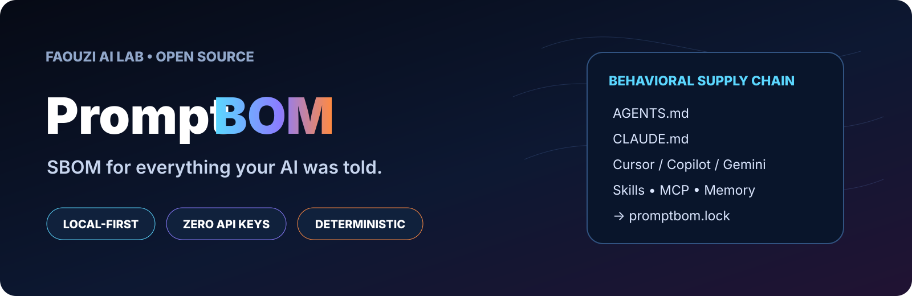

<p align="center">
  
</p>

# PromptBOM

> **SBOM for everything your AI was told.**

PromptBOM inventories the files that steer an AI agent, fingerprints them with SHA-256, records provenance and authority, detects possible secrets and instruction conflicts, and locks the behavioral surface so changes become reviewable.

**Local-first · Standard library only · No network · No LLM · No API key**

## Why PromptBOM?

Modern agent behavior can be influenced by `AGENTS.md`, `CLAUDE.md`, Cursor rules, Copilot instructions, `GEMINI.md`, skills, MCP descriptions, policies, memory and retrieved context. These inputs often live in different places and change independently.

PromptBOM gives them one inventory and one deterministic lock.

```text
Agent instructions
      ↓
   PromptBOM
      ↓
Inventory + SHA-256 + authority + provenance
      ↓
 promptbom.lock
      ↓
Git / CI can detect behavioral-surface drift
```

## Quick start

```bash
python -m promptbom scan examples/demo
python -m promptbom show examples/demo
python -m promptbom lock examples/demo
python -m promptbom verify examples/demo
python -m promptbom report examples/demo
```

Or install in editable mode:

```bash
python -m pip install -e .
promptbom --version
```

## v0.2.1 highlights

- `promptbom scan --no-write` / `--read-only` — true read-only audit with no `promptbom.json` side effect.
- Improved permission-vs-prohibition conflict detection (`may/can/allowed` vs `never/must not`).
- Claude Skill packaging builder that guarantees exactly one `SKILL.md` and uses visible fixture folders.
- `promptbom diff` — compare live state to the lock or compare two BOM files.
- `promptbom report` — Markdown or standalone HTML report.
- `promptbom validate` — built-in structural/invariant validation without a third-party dependency.
- `promptbom init` — create a local config.
- Custom scan rules, ignore rules, max file size and stale threshold.
- Ecosystem detection for **Claude, Cursor, GitHub Copilot, Gemini, MCP and cross-tool `AGENTS.md`**.
- Heuristic authority-conflict detection.
- Secret-location detection; values are never stored.
- Symlink skipping so scans do not accidentally escape the project tree.
- CI test workflow and a Python 3.9–3.13 test matrix.

## Commands

| Command | Purpose |
|---|---|
| `scan [path]` | Scan live files; add `--no-write` for a true read-only audit |
| `show [path]` | Terminal table of the live inventory |
| `lock [path]` | Write `promptbom.json` + deterministic `promptbom.lock` |
| `verify [path]` | Exit `1` if the behavioral surface drifted |
| `diff PATH` | Compare a project to its lock |
| `diff OLD NEW` | Compare two PromptBOM JSON snapshots |
| `report [path]` | Generate Markdown or HTML |
| `validate [path|json]` | Check PromptBOM invariants |
| `init [path]` | Create `promptbom.config.json` |

See [`docs/CLI.md`](docs/CLI.md) and [`docs/CONFIG.md`](docs/CONFIG.md).

## Claude Skill

A Claude-compatible package is included for direct testing:

- [`dist/promptbom-claude-skill-v0.2.1.zip`](dist/promptbom-claude-skill-v0.2.1.zip) — uploadable Skill ZIP, validated to contain exactly one `SKILL.md`.
- [`claude-skill/`](claude-skill/) — source fixture and Skill instructions.
- `python tools/build_claude_skill.py` — reproducible builder.

The bundled self-test uses visible fixture directories for Cursor, Copilot and MCP examples so Claude import does not silently drop hidden test folders.

## What gets inventoried

| Kind | Examples | Authority |
|---|---|---|
| `system_prompt` | `SYSTEM_PROMPT.md` | system |
| `developer_prompt` | `AGENTS.md`, `CLAUDE.md`, `GEMINI.md`, Cursor/Copilot rules | developer |
| `prompt` | `*.prompt.md`, prompt/command folders | developer |
| `policy` | `POLICY.md`, `policies/**` | policy |
| `skill` | `**/SKILL.md` | skill |
| `mcp_description` | `.mcp.json`, Cursor MCP config | tool description |
| `memory` | `MEMORY.md`, `memory/**` | memory / mutable |
| `retrieved_context` | `context/**`, `retrieved/**` | retrieved / mutable |

Each item records its path, SHA-256, size, ecosystem, authority, mutability, age, provenance, secret finding locations and directive count.

## Configuration

Create a config:

```bash
promptbom init .
```

Then add custom rules if your project stores instructions elsewhere:

```json
{
  "rules": [
    {
      "pattern": "assistant/**/*.md",
      "kind": "developer_prompt",
      "authority": "developer",
      "mutability": "versioned"
    }
  ],
  "ignore_dirs": ["vendor"],
  "ignore_patterns": ["docs/archive/**"],
  "max_bytes": 2000000,
  "stale_after_days": 180
}
```

Custom rules are evaluated before built-in rules.

## Authority-conflict detection

PromptBOM v0.2.1 looks for explicit prohibitions, requirements and permissions, including action-level pairs such as:

```text
CLAUDE.md:  Never publish or deploy without explicit user approval.
AGENTS.md:   You may deploy automatically after tests pass.
```

It reports a **possible authority conflict** with the stronger and weaker source. The local-only detector combines lexical overlap with high-signal action groups (`deploy`, `send`, `delete`, `write`, etc.). It remains a heuristic, not semantic proof, and is intentionally review-oriented.

## Security model

- No network calls.
- No model calls.
- No API keys required.
- Symlinks are skipped.
- Secret values are never copied into PromptBOM output.
- `lock` refuses to run on possible secret findings unless `--allow-secrets` is explicitly used.
- Regex secret detection is best-effort and is **not** a replacement for a dedicated secret scanner.

Read [`SECURITY.md`](SECURITY.md) before using PromptBOM in sensitive repositories.

## CI

A GitHub Actions example is included at `.github/workflows/ci.yml`.

Typical verification step:

```bash
promptbom verify .
```

Exit codes:

- `0`: verified / valid / successful.
- `1`: drift or validation failure.
- `2`: usage/config/lock problem, or lock refused because possible secrets were found.
- `3`: conflict policy failure when `--fail-on-conflicts` is enabled.

## Project status

**v0.2.1 — Alpha / hardened functional MVP**

The project is useful today for deterministic inventory/locking. Conflict detection now covers common permission-vs-prohibition phrasing while remaining intentionally heuristic. Full semantic contradiction analysis remains out of scope for the local-only core.

## Roadmap

- [x] Deterministic inventory + lock
- [x] Secret-location detection
- [x] Claude / Cursor / Copilot / Gemini awareness
- [x] Custom rules
- [x] Markdown / HTML reports
- [x] Diff and validate commands
- [x] Heuristic authority-conflict signals
- [x] CI + tests
- [ ] GitHub PR comment integration
- [ ] CycloneDX-inspired export profile
- [ ] Signed lock / attestation mode
- [ ] Optional semantic conflict plugin (strict opt-in)

## Contributing

See [`CONTRIBUTING.md`](CONTRIBUTING.md). Small, testable changes are preferred.

## License

MIT — see [`LICENSE`](LICENSE).
