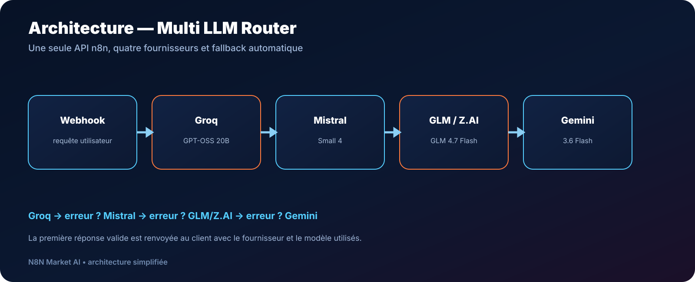

# Multi LLM Router — Groq + Mistral + GLM + Gemini — Workflow n8n

> **Routeur multi‑LLM avec fallback automatique, webhook unique et 4 fournisseurs IA.**

<p align="center">
  <a href="https://n8nmarketai.com/products/multi-llm-router-groq-mistral-glm-gemini-workflow-n8n">
    
  </a>
</p>

---

## 🎯 Ce workflow automatise

- Réception d'une requête via un webhook n8n
- Appel de **Groq** en priorité
- Basculement vers **Mistral AI** en cas d'échec
- Basculement vers **GLM / Z.AI** si nécessaire
- Dernier secours via **Google Gemini**
- Réponse JSON standardisée avec `provider`, `model`, `reply` et `statusCode`
- Continuité du workflow même en cas d'erreur HTTP ou réseau

---

## 🗺️ Architecture



```text
Webhook
  ↓
Normalisation
  ↓
Groq
  ↓ erreur
Mistral
  ↓ erreur
GLM / Z.AI
  ↓ erreur
Gemini
  ↓
Réponse JSON
```

---

## ⚙️ Modèles par défaut

| Fournisseur | Modèle |
|---|---|
| Groq | `openai/gpt-oss-20b` |
| Mistral AI | `mistral-small-2603` |
| Z.AI / GLM | `glm-4.7-flash` |
| Google Gemini | `gemini-3.6-flash` |

> Les offres gratuites, quotas, noms de modèles et conditions d'utilisation sont gérés par chaque fournisseur et peuvent évoluer.

---

## 📋 Prérequis

- Une instance **n8n**
- Une clé API pour chaque fournisseur que vous souhaitez utiliser
- Un accès Internet depuis l'instance n8n
- Les nœuds standards : Webhook, Code, Set, IF et HTTP Request

---

## 🚀 Installation

1. Acheter et télécharger le pack depuis **N8N Market AI**
2. Importer le fichier JSON dans n8n
3. Ouvrir le nœud **CONFIG - CLES API**
4. Ajouter vos propres clés API
5. Enregistrer et activer le workflow
6. Utiliser l'URL Production du webhook `ai-router-free`

Exemple de requête :

```json
{
  "message": "Explique-moi n8n simplement",
  "system": "Tu es un assistant professionnel.",
  "temperature": 0.4,
  "max_tokens": 800
}
```

---

## 🔐 Sécurité

- Aucune clé API personnelle n'est incluse
- Ne publiez jamais vos clés dans GitHub
- Pour la production, privilégiez les credentials n8n ou les variables d'environnement
- Le dépôt GitHub présente le produit et sa documentation ; le fichier JSON complet est livré avec le pack acheté

---

## 💡 Cas d'usage

- Assistant IA personnel
- Agent conversationnel
- Backend IA pour SaaS
- Automatisation n8n résiliente
- Prototype multi‑modèles
- API commune pour plusieurs applications

---

## 📦 Inclus dans le pack

- Workflow n8n JSON prêt à importer
- Guide d'installation Markdown
- Configuration du fallback Groq → Mistral → GLM → Gemini
- Exemple de requête et de réponse

---

## 📝 Licence

Usage personnel et commercial autorisé dans vos propres projets.  
La revente ou redistribution du fichier source du workflow n'est pas autorisée.

---

<p align="center">
  <b>N8N Market AI</b><br>
  Automatisations & agents IA prêts à déployer
</p>
