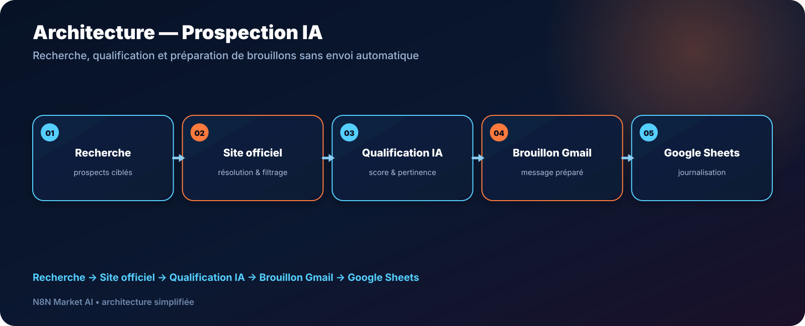

# Prospection IA B2B — Qualification + Brouillons Gmail — n8n

> **Un workflow de prospection B2B qui recherche des prospects, filtre les profils peu pertinents, qualifie les opportunités avec l’IA et prépare des brouillons Gmail — sans envoyer automatiquement les emails.**

[**🛒 Commander Prospection IA — 29 € →**](https://n8nmarketai.com/)

## 🛒 Offre N8N Market AI

| | |
|---|---|
| 💰 **Prix** | **29 €** |
| 📌 **Statut** | **✅ LIVRABLE** |
| 📦 **Livraison** | Prêt à livrer après achat |
| 🧩 **Niveau** | Intermédiaire |
| ⏱️ **Installation estimée** | 30–60 min* |
| 🔧 **Personnalisation** | Disponible |
| ✉️ **Envoi automatique** | **Non — brouillons Gmail uniquement** |

*Estimation hors création, validation ou récupération des accès aux services externes.

---

## Pourquoi ce produit ?

La prospection manuelle oblige à chercher des entreprises, vérifier leur site, trouver un contact exploitable, décider si le prospect mérite une approche puis préparer un message.

Ce workflow automatise une grande partie de cette préparation tout en gardant **l’envoi sous contrôle humain**.

Il aide à :

- rechercher des prospects selon les critères configurés ;
- privilégier les entreprises disposant d’un site officiel ;
- filtrer les résultats peu pertinents ;
- qualifier les prospects avec un score ;
- préparer un brouillon Gmail personnalisé ;
- éviter les doublons ;
- conserver un historique dans Google Sheets.

## Pour qui ?

- indépendants et consultants B2B ;
- petites équipes commerciales ;
- agences ;
- prestataires de services ;
- entreprises souhaitant structurer leur prospection sans automatiser aveuglément l’envoi.

## Avant / Après

| Avant | Avec le workflow |
|---|---|
| Recherche manuelle de prospects | Recherche structurée et automatisée |
| Vérification répétitive des sites | Résolution du site officiel intégrée |
| Qualification subjective | Score de pertinence selon les règles configurées |
| Emails préparés un par un | Brouillons Gmail générés automatiquement |
| Risque de contacter deux fois le même prospect | Déduplication et journalisation |
| Envoi difficile à contrôler | Aucun envoi automatique |

## Architecture

**Recherche → Site officiel → Qualification IA → Brouillon Gmail → Google Sheets**

## Fonctionnement

1. **Recherche des prospects**  
   Le workflow collecte des résultats correspondant à la cible configurée.

2. **Résolution et filtrage**  
   Il privilégie les sites officiels et bloque les sources parasites prévues par les règles.

3. **Qualification IA**  
   Le prospect est analysé selon les critères métier.

4. **Préparation du message**  
   Un brouillon Gmail est généré pour révision humaine.

5. **Journalisation**  
   Les prospects traités sont enregistrés dans Google Sheets pour le suivi et la déduplication.

## Points validés — version V5.1

- version de référence : **V5.1** ;
- seuil de qualification configuré à **75/100** ;
- priorité aux prospects disposant d’un site web ;
- exclusion de catégories jugées peu pertinentes dans cette configuration ;
- blocage d’annuaires parasites ;
- clé SerpAPI via `SERPAPI_API_KEY` ;
- **brouillons Gmail uniquement** ;
- déduplication et journalisation Google Sheets.

## Cas d’usage

### Prospection locale
Rechercher des entreprises dans une zone géographique donnée puis préparer les contacts à examiner.

### Agence B2B
Constituer une liste de prospects qualifiés et conserver une trace claire des approches préparées.

### Commercial indépendant
Réduire le temps passé à préparer chaque premier contact tout en relisant chaque email avant envoi.

### Campagne ciblée
Adapter les critères de qualification à un secteur, une zone ou un profil d’entreprise spécifique.

## 🛡️ Garde-fous

- aucun email n’est envoyé automatiquement ;
- l’utilisateur garde la validation finale dans Gmail ;
- aucune clé API ne doit être publiée dans GitHub ;
- les credentials restent configurés dans n8n ;
- la déduplication limite les traitements répétés ;
- les règles de qualification peuvent être adaptées au client.

## 📦 Ce que vous recevez

- le workflow n8n importable ;
- la version commerciale basée sur **V5.1** ;
- le guide de configuration ;
- les paramètres à personnaliser ;
- la liste des comptes et credentials à connecter ;
- la structure nécessaire au suivi Google Sheets.

> Le fichier JSON commercial complet n’est pas publié dans ce dépôt.

## Prérequis

Selon la configuration commerciale :

- n8n ;
- Gmail ;
- Google Sheets ;
- SerpAPI ;
- un fournisseur IA compatible avec le workflow.

## FAQ

### Le workflow envoie-t-il les emails tout seul ?
Non. Il prépare des brouillons Gmail. L’utilisateur vérifie et décide de l’envoi.

### Puis-je changer le score minimum ?
Oui. Le seuil et les règles de qualification peuvent être adaptés.

### Peut-on cibler un autre secteur ou une autre ville ?
Oui. Les critères de recherche font partie des éléments personnalisables.

### Les doublons sont-ils gérés ?
La version de référence inclut une logique de déduplication et de journalisation Google Sheets.

### Mes clés API sont-elles incluses dans GitHub ?
Non. Elles restent configurées dans l’environnement n8n du client.

---

## Prêt à structurer votre prospection ?

Automatisez la recherche et la qualification, puis gardez la décision finale avant chaque envoi.

[**🛒 Commander Prospection IA — 29 € →**](https://n8nmarketai.com/)

[← Retour au catalogue N8N Market AI](../../README.md)
