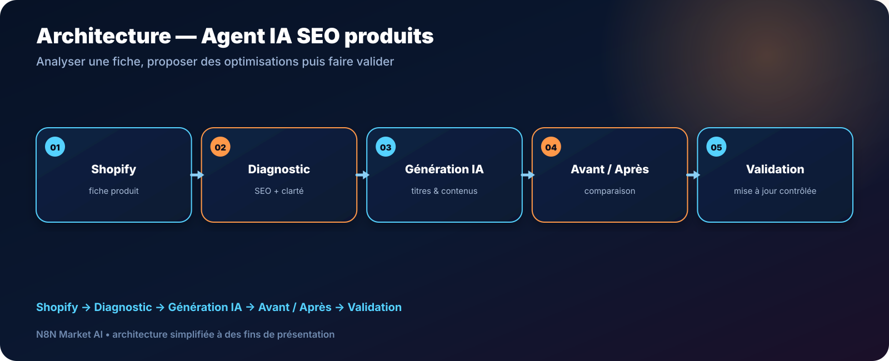

# Agent IA SEO & Fiches Produits pour Shopify — n8n

> **Un agent IA qui analyse une fiche produit Shopify, prépare une version optimisée et laisse la validation finale à l'utilisateur avant toute mise à jour.**

[**🛠️ Commander une version personnalisée — 29 € →**](https://n8nmarketai.com/products/agent-ia-seo-fiches-produits-shopify-n8n)

## 🛒 Offre N8N Market AI

| | |
|---|---|
| 💰 **Prix** | **29 €** |
| 📌 **Statut** | **🟠 BETA / PERSONNALISATION** |
| 📦 **Livraison** | Finalisation + validation avant livraison |
| 🧩 **Niveau** | Intermédiaire |
| ⏱️ **Installation estimée** | 30–60 min* |
| 🔧 **Personnalisation** | Disponible |

*Estimation hors récupération, création ou validation des accès externes.

---

## Pourquoi ce produit ?

Optimiser manuellement des dizaines de fiches produits demande de relire les titres, descriptions, bénéfices, métadonnées et arguments commerciaux un par un.

Il vise à :
- diagnostiquer les fiches produits ;
- proposer des titres plus clairs ;
- préparer des descriptions orientées bénéfices ;
- générer meta title, meta description et FAQ ;
- comparer la version actuelle à la proposition ;
- conserver une validation humaine avant publication.

## Pour qui ?

- boutiques Shopify ;
- marques e-commerce ;
- catalogues avec plusieurs produits ;
- agences e-commerce ;
- équipes SEO/marketing réduites.

## Avant / Après

| Avant | Avec le workflow |
|---|---|
| Audit manuel produit par produit | Diagnostic assisté |
| Réécriture lente | Proposition générée |
| SEO et vente traités séparément | Optimisation regroupée |
| Risque de publication trop rapide | Validation humaine |
| Difficile de comparer | Version avant / après |

## Architecture

**Shopify → Diagnostic → Génération IA → Avant / Après → Validation**

## Fonctionnement cible

1. Lire les champs produit Shopify.
2. Analyser clarté, SEO et informations manquantes.
3. Préparer les propositions de titre, description, FAQ et métadonnées.
4. Présenter la comparaison avant/après.
5. Appliquer uniquement après validation explicite.

## Cas d'usage

### Catalogue important
Préparer plus vite une file de produits à optimiser.

### Nouvelle collection
Harmoniser le ton et la structure des fiches.

### Agence Shopify
Adapter la logique au ton et aux champs de chaque client.

## ⚠️ À finaliser avant livraison

- adapter les champs Shopify au catalogue réel ;
- valider le prompt selon le ton de marque ;
- tester la gestion des champs manquants ;
- confirmer la méthode de mise à jour Shopify ;
- conserver une étape d’approbation explicite.

## Limites

- ne garantit pas un gain SEO ou de conversion ;
- la qualité dépend des données produit disponibles ;
- les règles de marque doivent être fournies ;
- la version standard ne publie pas sans validation.

## 🛡️ Garde-fous recommandés

- aucune mise à jour automatique par défaut ;
- validation humaine ;
- aucun changement automatique de prix ;
- credentials Shopify stockés dans n8n ;
- journalisation recommandée des modifications.

## 📦 Ce que vous recevez

Après finalisation :
- workflow adapté au catalogue ;
- prompt et règles personnalisés ;
- guide Shopify/n8n ;
- structure avant/après ;
- guide de validation ;
- paramètres de champs à personnaliser.

> Le fichier JSON commercial complet, les clés API et les credentials clients ne sont pas publiés dans ce dépôt.

## Prérequis

- n8n ;
- boutique Shopify ;
- credentials Shopify ;
- fournisseur IA ;
- règles de marque si disponibles.

## FAQ

### Le workflow publie-t-il directement les modifications ?
Pas par défaut. La validation humaine est prévue avant mise à jour.

### Peut-il adapter le ton à ma marque ?
Oui.

### Travaille-t-il aussi les meta descriptions ?
Oui, selon la configuration.

### Peut-il modifier les prix ?
Non dans la configuration commerciale prévue.

---

## Optimisez vos fiches sans perdre le contrôle éditorial

[**🛠️ Commander la version personnalisée — 29 € →**](https://n8nmarketai.com/products/agent-ia-seo-fiches-produits-shopify-n8n)

[← Retour au catalogue N8N Market AI](../../README.md)
