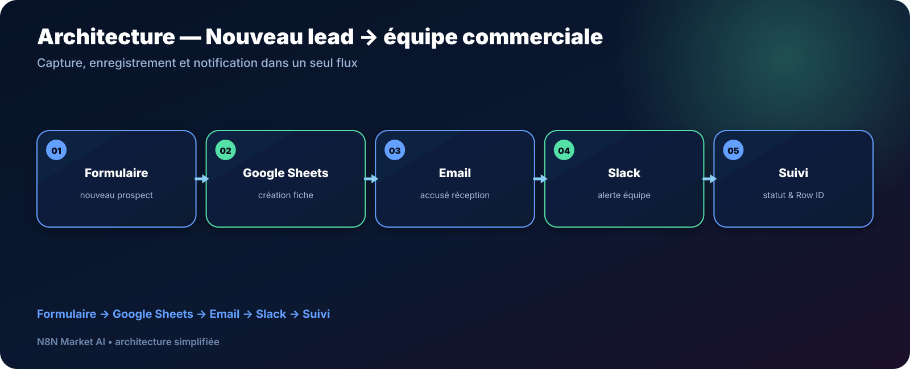

# Nouveau lead → Google Sheets + Slack — Workflow n8n

> **Un workflow pour transformer chaque nouveau formulaire en fiche prospect, accusé de réception et notification immédiate à l’équipe commerciale.**

[**🛠️ Commander une version personnalisée — 29 € →**](https://n8nmarketai.com/)

## 🛒 Offre N8N Market AI

| | |
|---|---|
| 💰 **Prix** | **29 €** |
| 📌 **Statut** | **🟠 BETA / PERSONNALISATION** |
| 📦 **Livraison** | Finalisation + validation avant livraison |
| 🧩 **Niveau** | Facile à intermédiaire |
| ⏱️ **Installation estimée** | 15–30 min* |
| 🔧 **Personnalisation** | Formulaire, colonnes Sheets, Slack et statuts |

*Estimation hors création, validation ou récupération des accès externes.

---

## Pourquoi ce produit ?

Lorsqu’un prospect remplit un formulaire, le délai entre sa demande et la prise en charge commerciale compte.

Ce workflow prépare une chaîne simple :

- enregistrer automatiquement le prospect ;
- envoyer un accusé de réception ;
- prévenir l’équipe dans Slack ;
- centraliser le suivi dans Google Sheets.

## Pour qui ?

- petites équipes commerciales ;
- agences ;
- indépendants ;
- services qui reçoivent des demandes via formulaire ;
- entreprises sans CRM complexe.

## Avant / Après

| Avant | Avec le workflow |
|---|---|
| Copier les données du formulaire | Création automatique dans Sheets |
| Vérifier régulièrement les nouveaux leads | Notification Slack immédiate |
| Répondre manuellement à chaque demande | Accusé de réception automatisé |
| Statuts dispersés | Suivi centralisé |
| Risque d’oublier une demande | Processus reproductible |

## Architecture

**Formulaire → Google Sheets → Email → Slack → Suivi**

## Fonctionnement prévu

1. réception d’un nouveau formulaire ;
2. création de la fiche prospect dans Google Sheets ;
3. envoi d’un accusé de réception ;
4. notification de l’équipe dans Slack ;
5. mise à jour des informations de suivi.

## Cas d’usage

### Demande de devis
Créer automatiquement une ligne prospect et avertir le commercial.

### Formulaire de contact
Centraliser toutes les demandes entrantes dans un tableau unique.

### Petite agence
Distribuer plus rapidement les nouveaux leads à l’équipe.

## À finaliser avant livraison

La version commerciale doit être adaptée et vérifiée sur l’environnement du client, notamment :

- définir précisément les colonnes Google Sheets attendues ;
- utiliser un statut cohérent comme **Email envoyé** plutôt que **Contacté** si aucun commercial n’a encore pris contact ;
- vérifier le mapping du **Row ID** pour les mises à jour ;
- décider si une déduplication par email doit être ajoutée.

## Limites

- pas de CRM tiers natif dans cette version ;
- déduplication à prévoir si le client en a besoin ;
- le formulaire n8n natif reste fonctionnel mais simple visuellement ;
- Typeform ou Tally nécessitent une adaptation du déclencheur.

## 📦 Ce que vous recevez

- une version finalisée pour votre environnement ;
- le workflow n8n importable après validation ;
- le guide de configuration ;
- la structure Google Sheets requise ;
- les paramètres Slack et email à personnaliser.

## FAQ

### Puis-je utiliser Typeform ou Tally ?
Oui, avec adaptation du déclencheur.

### Peut-on éviter les doublons ?
Oui, une règle de déduplication peut être ajoutée.

### Slack est-il obligatoire ?
Non, le canal de notification peut être adapté.

### Le workflow remplace-t-il un CRM ?
Non. Il propose une gestion simple basée sur Google Sheets.

---

## Répondez plus vite aux nouveaux prospects

[**🛠️ Commander la version personnalisée — 29 € →**](https://n8nmarketai.com/)

[← Retour au catalogue N8N Market AI](../../README.md)
