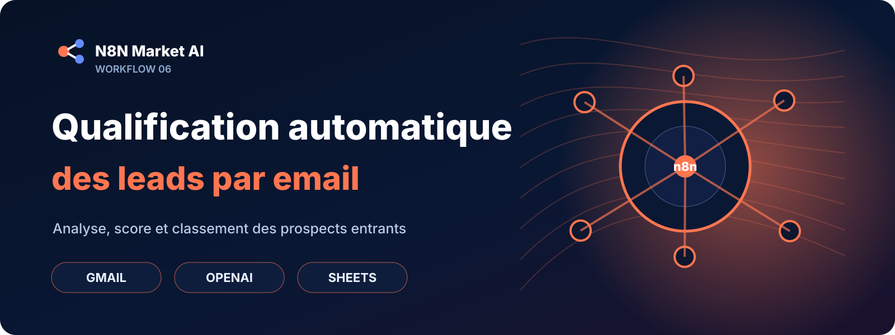

# Qualification automatique des leads par email

## 🛒 Offre N8N Market AI

| | |
|---|---|
| 💰 **Prix** | **29 €** |
| 📌 **Statut** | **🟠 BETA / PERSONNALISATION** |
| 📦 **Livraison** | Personnalisation + validation avant livraison |
| 🧩 **Niveau** | Intermédiaire |
| ⏱️ **Installation estimée** | 30–45 min* |
| 🔧 **Personnalisation** | Disponible |

[**🛠️ Commander une version personnalisée →**](https://n8nmarketai.com/)

*Estimation hors création, validation ou récupération des accès aux services externes.

## 📦 Ce que vous recevez

- une version finalisée et adaptée à votre environnement ;
- le workflow n8n importable après validation ;
- le guide de configuration ;
- la liste des comptes, API et credentials à connecter ;
- les paramètres à personnaliser.

> Le fichier JSON commercial complet, les clés API et les credentials clients ne sont pas publiés sur GitHub.

Les commerciaux perdent chaque jour plus d’une heure à trier manuellement les emails de prospects. Ce workflow identifie automatiquement les leads chauds, extrait les informations clés et notifie immédiatement le bon commercial. Les prospects reçoivent une réponse automatique tandis que tous les échanges sont tracés dans un tableau de suivi.

## Pour qui ?

Équipes commerciales et marketing qui reçoivent de nombreux leads par email et veulent gagner du temps sur le tri et la qualification.

## Prérequis

Connecter un compte Gmail (IMAP + SMTP), une clé API OpenAI et un compte Google Sheets.

## Version commerciale

Le JSON n8n complet reste privé. Le pack commercial comprendra le workflow importable, la documentation et les paramètres de configuration.

## Point à corriger avant commercialisation

Le JSON est corrompu car il manque le noeud declencheur Email Trigger mentionne dans la description. Il faut imperativement reexporter le workflow depuis n8n en s assurant de selectionner tous les noeuds. Sans cela, le template est techniquement invalide.

## Limites

Le workflow ne lit pas les pièces jointes ni les emails en image. Il ne met pas à jour un vrai CRM comme HubSpot ou Salesforce. La classification dépend de la qualité de rédaction du prospect et peut se tromper sur des emails courts ou ambigus. Il ne gère pas les réponses aux relances, seulement les premiers contacts.

## Tags

qualification leads, triage email, lead scoring, automatisation commerciale, openai, google sheets, gmail

---

[← Retour au catalogue N8N Market AI](../../README.md)
