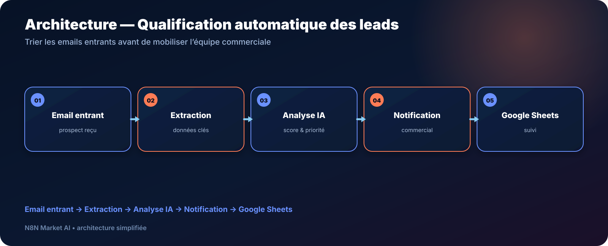

# Qualification automatique des leads par email — IA + n8n

> **Un workflow conçu pour analyser les premiers emails de prospects, extraire les informations utiles et aider l’équipe commerciale à prioriser les demandes.**

[**🛠️ Commander une version personnalisée — 29 € →**](https://n8nmarketai.com/)

## 🛒 Offre N8N Market AI

| | |
|---|---|
| 💰 **Prix** | **29 €** |
| 📌 **Statut** | **🟠 BETA / PERSONNALISATION** |
| 📦 **Livraison** | Reconstruction/validation avant livraison |
| 🧩 **Niveau** | Intermédiaire |
| ⏱️ **Installation estimée** | 30–45 min* |
| 🔧 **Personnalisation** | Critères, scoring, réponse et notifications |

*Estimation hors récupération et validation des accès externes.

---

## Pourquoi ce produit ?

Quand beaucoup d’emails commerciaux arrivent, une partie du temps est perdue à lire, comprendre et classer chaque demande.

L’objectif de ce workflow est d’aider à :

- détecter les emails de prospects ;
- extraire les informations importantes ;
- qualifier leur priorité ;
- notifier le bon interlocuteur ;
- conserver le suivi dans Google Sheets.

## Pour qui ?

- équipes commerciales ;
- petites agences ;
- services avant-vente ;
- entreprises recevant leurs demandes principalement par email.

## Avant / Après

| Avant | Avec le workflow |
|---|---|
| Lecture manuelle de chaque email | Extraction structurée |
| Priorité décidée au cas par cas | Qualification selon les règles configurées |
| Informations copiées à la main | Journalisation dans Sheets |
| Risque de retard sur un lead important | Notification prévue pour les leads prioritaires |
| Processus difficile à mesurer | Historique centralisé |

## Architecture

**Email entrant → Extraction → Analyse IA → Notification → Google Sheets**

## Fonctionnement cible

1. réception de l’email entrant ;
2. extraction des informations utiles ;
3. analyse et qualification IA ;
4. classification/priorisation ;
5. notification commerciale ;
6. journalisation.

## Cas d’usage

### Boîte commerciale générique
Trier les demandes reçues sur une adresse type contact@.

### Agence
Repérer rapidement les demandes correspondant aux services les plus importants.

### PME
Réduire le temps passé à classer les premiers contacts.

## ⚠️ À finaliser avant livraison

La version source actuelle doit être **reconstruite/revalidée avant vente** :

- le déclencheur email attendu manque dans l’export de référence ;
- le workflow doit être réexporté depuis n8n avec tous les nœuds nécessaires ;
- le scoring doit être validé sur les règles métier du client ;
- les réponses automatiques éventuelles doivent être testées avant activation.

Cette fiche décrit donc le **produit commercial cible**, pas un JSON prêt à être utilisé tel quel aujourd’hui.

## Limites

- pas d’analyse fiable des pièces jointes dans la conception actuelle ;
- les emails très courts ou ambigus peuvent nécessiter une validation humaine ;
- pas d’intégration CRM native HubSpot/Salesforce dans cette version ;
- centré sur le premier contact, pas sur tout le cycle de relance.

## 🛡️ Garde-fous recommandés

- validation humaine pour les cas ambigus ;
- seuil minimum avant notification prioritaire ;
- journalisation des décisions ;
- credentials conservés dans n8n ;
- phase de test avant activation des réponses automatiques.

## 📦 Ce que vous recevez

Après finalisation :

- le workflow n8n importable ;
- le guide de configuration ;
- les critères de qualification personnalisés ;
- la structure Google Sheets ;
- la liste des credentials nécessaires.

## FAQ

### Le workflow est-il déjà prêt à importer ?
Pas dans son export source actuel. Il doit être finalisé et validé avant livraison.

### Puis-je choisir mes critères de scoring ?
Oui. La personnalisation des critères fait partie de la préparation.

### Peut-il se connecter à un CRM ?
Une intégration CRM demanderait une adaptation dédiée.

### L’IA est-elle toujours correcte ?
Non. Les cas ambigus doivent pouvoir être vérifiés humainement.

---

## Structurez le tri de vos leads entrants

[**🛠️ Commander une version finalisée — 29 € →**](https://n8nmarketai.com/)

[← Retour au catalogue N8N Market AI](../../README.md)
