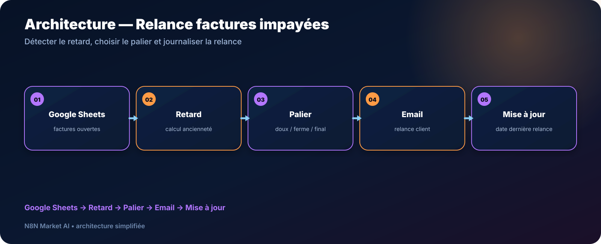

# Relance automatique de factures impayées par email — n8n

> **Un workflow pour détecter les factures en retard dans Google Sheets, appliquer un palier de relance et conserver une trace de la dernière action.**

[**🛠️ Commander une version personnalisée — 29 € →**](https://n8nmarketai.com/)

## 🛒 Offre N8N Market AI

| | |
|---|---|
| 💰 **Prix** | **29 €** |
| 📌 **Statut** | **🟠 BETA / PERSONNALISATION** |
| 📦 **Livraison** | Finalisation + validation avant livraison |
| 🧩 **Niveau** | Facile à intermédiaire |
| ⏱️ **Installation estimée** | 20–40 min* |
| 🔧 **Personnalisation** | Paliers, délais, ton et feuille de suivi |

*Estimation hors récupération et validation des accès externes.

---

## Pourquoi ce produit ?

Les relances de paiement sont répétitives mais sensibles : il faut savoir **qui relancer, quand et avec quel ton**.

Le workflow vise à automatiser la préparation et l’envoi des relances à partir d’une feuille Google Sheets structurée.

## Pour qui ?

- freelances ;
- indépendants ;
- petites entreprises ;
- services administratifs avec suivi simple des factures.

## Avant / Après

| Avant | Avec le workflow |
|---|---|
| Vérifier les échéances manuellement | Détection automatique du retard |
| Écrire chaque relance | Modèle selon le palier |
| Ton identique à tous les retards | Relance douce / ferme / finale |
| Risque de relancer trop souvent | Contrôle via la dernière date de relance |
| Historique incomplet | Mise à jour de la feuille |

## Architecture

**Google Sheets → Retard → Palier → Email → Mise à jour**

## Fonctionnement cible

1. lecture des factures ouvertes ;
2. calcul de l’ancienneté du retard ;
3. contrôle de la date de dernière relance ;
4. choix du palier ;
5. envoi du message ;
6. mise à jour de la date de relance ;
7. récapitulatif au responsable si prévu.

## Cas d’usage

### Freelance
Automatiser les rappels sans suivre chaque échéance quotidiennement.

### Petite entreprise
Appliquer une politique de relance cohérente à toute l’équipe.

### Gestion administrative
Conserver une trace des relances dans la feuille existante.

## ⚠️ À finaliser avant livraison

Avant commercialisation, la version doit notamment :

- filtrer correctement la **date de dernière relance** pour éviter des emails quotidiens ;
- regrouper le récapitulatif interne afin d’éviter plusieurs emails au responsable ;
- fournir une structure Google Sheets clairement documentée ;
- tester les paliers de retard et leurs transitions.

## Limites

- paiements partiels non gérés nativement ;
- le statut payé doit provenir d’une donnée fiable dans la feuille ;
- pas de portail de paiement intégré ;
- pas de SMS ni courrier postal dans cette version ;
- gestion multi-devises non prévue par défaut.

## 🛡️ Garde-fous recommandés

- délai minimum entre deux relances ;
- exclusion des factures déjà payées ;
- plafonnement du nombre de relances ;
- journalisation de chaque email ;
- possibilité de validation manuelle du dernier palier.

## 📦 Ce que vous recevez

Après validation :

- workflow n8n importable ;
- modèle/structure Google Sheets ;
- règles de paliers personnalisées ;
- modèles d’emails ;
- guide d’installation ;
- paramètres de fréquence à adapter.

## FAQ

### Peut-on modifier les délais de relance ?
Oui.

### Peut-on utiliser plusieurs tons de message ?
Oui, selon les paliers configurés.

### Le workflow sait-il qu’un paiement partiel a eu lieu ?
Pas dans la version standard.

### Peut-on éviter de harceler le client ?
Oui, c’est précisément un point à contrôler dans la version finalisée avec un délai minimum entre relances.

---

## Automatisez les relances sans perdre le contrôle

[**🛠️ Commander la version personnalisée — 29 € →**](https://n8nmarketai.com/)

[← Retour au catalogue N8N Market AI](../../README.md)
