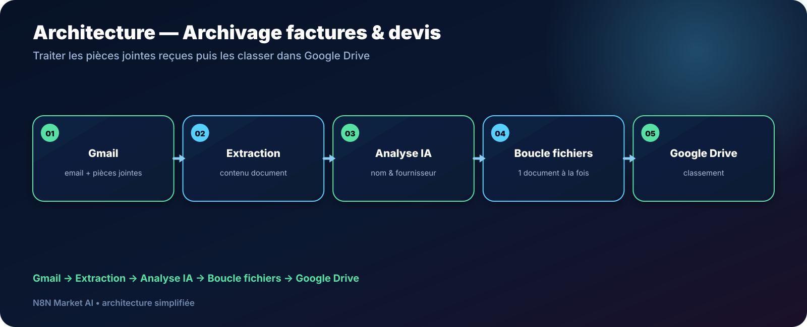

# Archivage automatique des factures et devis vers Google Drive — n8n

> **Un workflow conçu pour détecter les pièces jointes de facturation reçues par email, les analyser, les renommer puis les classer automatiquement dans Google Drive.**

[**🛠️ Commander une version personnalisée — 29 € →**](https://n8nmarketai.com/)

## 🛒 Offre N8N Market AI

| | |
|---|---|
| 💰 **Prix** | **29 €** |
| 📌 **Statut** | **🟠 BETA / PERSONNALISATION** |
| 📦 **Livraison** | Finalisation + validation avant livraison |
| 🧩 **Niveau** | Intermédiaire |
| ⏱️ **Installation estimée** | 30–60 min* |
| 🔧 **Personnalisation** | Dossiers, règles de nommage et fournisseurs |

*Estimation hors récupération et validation des accès externes.

---

## Pourquoi ce produit ?

Les factures et devis arrivent souvent dans des emails aux objets peu précis. Les télécharger, renommer puis ranger manuellement devient vite répétitif.

Le workflow cible un processus plus fiable :

- récupérer les pièces jointes ;
- lire le contenu utile du document ;
- identifier le fournisseur ou le type ;
- générer un nom cohérent ;
- traiter chaque fichier séparément ;
- l’archiver dans Google Drive.

## Pour qui ?

- comptables indépendants ;
- assistantes de direction ;
- TPE/PME ;
- prestataires recevant de nombreuses factures et devis par Gmail.

## Avant / Après

| Avant | Avec le workflow |
|---|---|
| Chercher les pièces jointes dans Gmail | Détection automatique |
| Renommer manuellement | Nommage préparé selon le contenu |
| Créer/ranger les dossiers à la main | Classement Drive automatisable |
| Oublier un fichier parmi plusieurs pièces jointes | Traitement document par document |
| Noms de fichiers incohérents | Convention de nommage structurée |

## Architecture

**Gmail → Extraction → Analyse IA → Boucle fichiers → Google Drive**

## Fonctionnement cible

1. détection d’un email avec pièces jointes ;
2. isolation des fichiers concernés ;
3. extraction du texte du document ;
4. analyse des informations utiles ;
5. génération d’un nom de fichier sécurisé avec fallback ;
6. traitement de chaque pièce jointe ;
7. upload dans le bon dossier Google Drive.

## Cas d’usage

### Cabinet indépendant
Centraliser automatiquement les factures reçues par email.

### Assistante de direction
Éviter le téléchargement et renommage répétitif des documents.

### TPE
Créer une archive Drive plus cohérente pour la comptabilité.

## ⚠️ À finaliser avant livraison

La conception actuelle doit être renforcée sur plusieurs points :

- **extraire le texte du PDF avant analyse IA** au lieu de se baser seulement sur l’objet de l’email ;
- gérer explicitement les **pièces jointes multiples** avec une boucle ;
- prévoir un fallback si l’IA renvoie un nom vide ou invalide ;
- vérifier le passage correct du binaire Gmail vers Google Drive dans la version n8n utilisée.

## Limites

- pièces jointes intégrées dans certains corps HTML non garanties ;
- déduplication des documents non prévue par défaut ;
- Outlook nécessite une adaptation ;
- la qualité de l’extraction dépend du type de PDF et du contenu disponible ;
- les documents scannés peuvent nécessiter un traitement supplémentaire.

## 🛡️ Garde-fous recommandés

- nom de fichier de secours si l’analyse échoue ;
- validation du type MIME ;
- filtrage des extensions autorisées ;
- journalisation du fichier et du dossier cible ;
- aucune suppression automatique de l’email source.

## 📦 Ce que vous recevez

Après finalisation :

- workflow n8n importable ;
- logique de traitement des pièces jointes ;
- règles de nommage personnalisées ;
- structure de dossiers Drive ;
- guide de configuration Gmail/Drive ;
- paramètres IA à adapter.

## FAQ

### Le workflow lit-il le contenu des PDF ?
La version commerciale finalisée doit intégrer cette étape avant l’analyse IA.

### Gère-t-il plusieurs pièces jointes ?
C’est un point obligatoire de la finalisation prévue.

### Fonctionne-t-il avec Outlook ?
Pas sans adaptation.

### Les fichiers sont-ils supprimés de Gmail ?
Non dans la conception prévue.

---

## Classez vos documents sans passer votre journée dans Gmail

[**🛠️ Commander la version personnalisée — 29 € →**](https://n8nmarketai.com/)

[← Retour au catalogue N8N Market AI](../../README.md)
