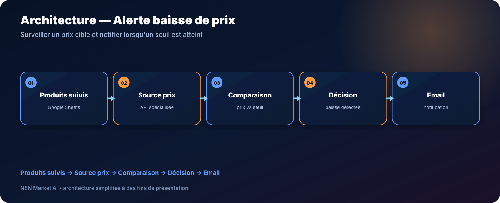

# Alerte automatique de baisse de prix Amazon — n8n

> **Un workflow pour surveiller une liste de produits, comparer le prix courant à un seuil cible et envoyer une alerte email lorsqu’une baisse intéressante est détectée.**

[**🛠️ Commander une version personnalisée — 29 € →**](https://n8nmarketai.com/products/alerte-email-automatique-baisse-de-prix-amazon-workflow-n8n)

## 🛒 Offre N8N Market AI

| | |
|---|---|
| 💰 **Prix** | **29 €** |
| 📌 **Statut** | **🟠 BETA / PERSONNALISATION** |
| 📦 **Livraison** | Finalisation + validation avant livraison |
| 🧩 **Niveau** | Intermédiaire |
| ⏱️ **Installation estimée** | 30–60 min* |
| 🔧 **Personnalisation** | Disponible |

*Estimation hors récupération, création ou validation des accès externes.

---

## Pourquoi ce produit ?

Vérifier régulièrement plusieurs pages produit à la main est répétitif. Une architecture de suivi permet de concentrer l’attention uniquement lorsque le seuil défini est atteint.

Il vise à :
- centraliser les produits suivis ;
- utiliser un seuil cible par produit ;
- récupérer le prix via une source adaptée ;
- comparer automatiquement ;
- envoyer une alerte uniquement si nécessaire.

## Pour qui ?

- acheteurs réguliers ;
- petites équipes achats ;
- utilisateurs qui suivent une liste limitée de produits ;
- personnes utilisant Google Sheets comme liste de surveillance.

## Avant / Après

| Avant | Avec le workflow |
|---|---|
| Ouvrir chaque page produit | Contrôle planifié |
| Se souvenir du prix cible | Seuil enregistré dans Sheets |
| Vérifier même sans changement | Alerte uniquement si condition remplie |
| Suivi dispersé | Liste centralisée |
| Scraping fragile | API spécialisée recommandée |

## Architecture

**Produits suivis → Source prix → Comparaison → Décision → Email**

## Fonctionnement cible

1. Lire les produits et seuils depuis Google Sheets.
2. Interroger une source de prix adaptée.
3. Normaliser la valeur récupérée.
4. Comparer au seuil cible.
5. Envoyer une alerte si la condition est remplie.
6. Mettre à jour le suivi si nécessaire.

## Cas d'usage

### Achats personnels
Suivre plusieurs articles sans vérifier chaque page.

### Petite entreprise
Surveiller certains achats récurrents.

### Veille prix simple
Conserver une liste de seuils dans Google Sheets.

## ⚠️ À finaliser avant livraison

La version commerciale doit être finalisée et testée dans l’environnement du client, notamment :
- remplacer le scraping direct par une source/API de prix adaptée ;
- fournir un modèle Google Sheets ;
- gérer les erreurs et données de prix absentes ;
- tester les variantes/références réellement surveillées ;
- documenter les coûts éventuels de la source de données.

## Limites

- la fiabilité dépend de la source de prix choisie ;
- les variantes couleur/taille nécessitent un identifiant précis ;
- les vendeurs tiers peuvent demander une logique supplémentaire ;
- les politiques et formats Amazon peuvent évoluer.

## 🛡️ Garde-fous recommandés

- pas d’alerte si le prix est invalide ;
- journalisation des erreurs ;
- limite de fréquence des vérifications ;
- credentials API dans n8n ;
- identifiant produit explicite.

## 📦 Ce que vous recevez

Après finalisation :
- workflow finalisé ;
- modèle Google Sheets ;
- configuration de la source de prix ;
- seuils personnalisables ;
- guide d’installation ;
- configuration email.

> Le fichier JSON commercial complet, les clés API et les credentials clients ne sont pas publiés dans ce dépôt.

## Prérequis

- n8n ;
- Google Sheets ;
- Gmail ou SMTP ;
- source/API de prix adaptée.

## FAQ

### Pourquoi ne pas scraper directement Amazon ?
Le scraping direct est fragile et peut être bloqué ; une source de données spécialisée est préférable.

### Puis-je avoir un seuil différent par produit ?
Oui.

### Le workflow suit-il toutes les variantes ?
Une variante doit être identifiée explicitement pour un suivi fiable.

### À quelle fréquence vérifie-t-il ?
La fréquence est personnalisable en tenant compte de la source de données utilisée.

---

## Recevez une alerte seulement quand le prix devient intéressant

[**🛠️ Commander la version personnalisée — 29 € →**](https://n8nmarketai.com/products/alerte-email-automatique-baisse-de-prix-amazon-workflow-n8n)

[← Retour au catalogue N8N Market AI](../../README.md)
