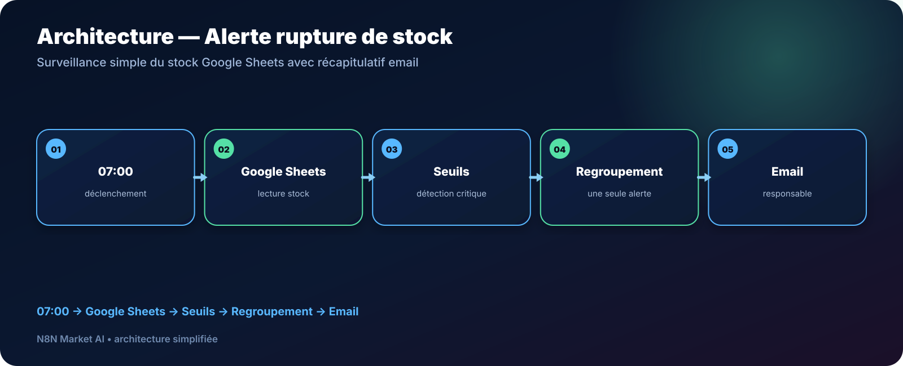

# Alerte automatique de rupture de stock avec Google Sheets — n8n

> **Un workflow simple pour surveiller un stock géré dans Google Sheets, détecter les produits sous leur seuil d’alerte et envoyer un seul récapitulatif au responsable.**

[**🆓 Tester gratuitement N8N Market AI →**](https://n8nmarketai.com/products/alerte-automatique-rupture-de-stock-google-sheets-workflow-n8n)

## 🛒 Offre N8N Market AI

| | |
|---|---|
| 💰 **Prix** | **GRATUIT — 0 €** |
| 🆓 **Offre** | **Workflow découverte N8N Market AI** |
| 📌 **Statut** | **🟢 PUBLIABLE** |
| 📦 **Livraison** | Après contrôle final |
| 🧩 **Niveau** | Facile |
| ⏱️ **Installation estimée** | 15–30 min* |
| 🔧 **Personnalisation** | Seuils, horaires et emails |

*Estimation hors création, validation ou récupération des accès aux services externes.

---

## Pourquoi ce workflow est gratuit ?

Ce workflow sert de **produit découverte** : il permet de tester la qualité de nos automatisations, notre documentation et notre approche n8n avant d’acheter un workflow premium.

Il reste volontairement simple, utile et personnalisable, sans remplacer les produits plus avancés du catalogue.

## Pourquoi ce produit ?

Une petite boutique qui suit son stock dans Google Sheets peut facilement rater un seuil critique si personne ne vérifie la feuille au bon moment.

Ce workflow transforme la feuille existante en **système d’alerte automatique**, sans imposer un logiciel de gestion de stock complexe.

Il permet de :

- vérifier automatiquement les quantités ;
- comparer chaque produit à son seuil d’alerte ;
- détecter les références critiques ;
- regrouper plusieurs alertes dans un seul email ;
- mémoriser la date de dernière alerte ;
- conserver Google Sheets comme source de données simple.

## Pour qui ?

- petites boutiques ;
- e-commerçants ;
- associations ou structures avec petit stock ;
- responsables logistiques utilisant Google Sheets ;
- entreprises ne disposant pas encore d’un ERP ou WMS.

## Avant / Après

| Avant | Avec le workflow |
|---|---|
| Ouvrir la feuille manuellement | Contrôle automatique planifié |
| Vérifier chaque ligne | Comparaison automatique au seuil |
| Découvrir une rupture trop tard | Alerte dès qu’un produit devient critique |
| Recevoir plusieurs messages | Regroupement en un récapitulatif |
| Aucun historique d’alerte | Date de dernière alerte mise à jour |

## Architecture

**07:00 → Google Sheets → Seuils → Regroupement → Email**

## Ce que fait le workflow

Chaque matin à **07:00** dans la configuration actuelle, il :

1. lit la feuille de stock Google Sheets ;
2. compare la quantité actuelle au seuil d’alerte ;
3. détecte les produits critiques ;
4. regroupe les alertes ;
5. envoie un email au responsable ;
6. met à jour la colonne `Dernière alerte envoyée`.

L’horaire peut être personnalisé.

## Structure Google Sheets

| produit | quantité actuelle | seuil d'alerte | Dernière alerte envoyée |
|---|---:|---:|---|
| Produit A | 5 | 10 | |
| Produit B | 25 | 8 | |

Un modèle CSV est prévu dans le dossier du produit.

## Cas d’usage

### Petite boutique
Être averti avant qu’une référence suivie dans Sheets n’atteigne un niveau critique.

### Fournitures internes
Surveiller consommables, matériel ou fournitures sans déployer une solution lourde.

### E-commerce simple
Utiliser Google Sheets comme tableau de stock lorsque le catalogue reste gérable manuellement.

## Personnalisation possible

- heure du contrôle ;
- fréquence ;
- seuil par produit ;
- destinataire de l’email ;
- contenu du récapitulatif ;
- colonnes Google Sheets ;
- règles empêchant des alertes trop fréquentes.

## Limites

Cette version :

- ne déduit pas automatiquement les ventes du stock ;
- ne commande pas automatiquement chez un fournisseur ;
- ne gère pas nativement plusieurs entrepôts ;
- dépend de données Google Sheets à jour.

Ces limites sont volontairement affichées afin que le client sache exactement ce que le workflow automatise.

## 📦 Ce que vous recevez

- le workflow n8n importable après validation finale ;
- le modèle de structure Google Sheets / CSV prévu ;
- le guide d’installation ;
- les paramètres de seuil à personnaliser ;
- les paramètres d’email ;
- une base simple à adapter.

## Prérequis

- n8n ;
- compte Google ;
- Google Sheets ;
- Gmail ou service d’envoi compatible ;
- feuille respectant la structure attendue.

## FAQ

### Faut-il un logiciel de stock ?
Non. Cette version s’appuie sur Google Sheets.

### Puis-je avoir un seuil différent pour chaque produit ?
Oui. Le seuil est prévu comme une donnée par ligne.

### L’horaire de 07:00 est-il obligatoire ?
Non. Il peut être personnalisé.

### Le workflow commande-t-il automatiquement chez mon fournisseur ?
Non. Il alerte le responsable ; il ne passe pas de commande.

### Peut-on gérer plusieurs entrepôts ?
Pas dans cette version standard. Cela demanderait une adaptation.

---

## Transformez votre Google Sheet en système d’alerte stock

[**🆓 Tester gratuitement ce workflow →**](https://n8nmarketai.com/products/alerte-automatique-rupture-de-stock-google-sheets-workflow-n8n)

[← Retour au catalogue N8N Market AI](../../README.md)
