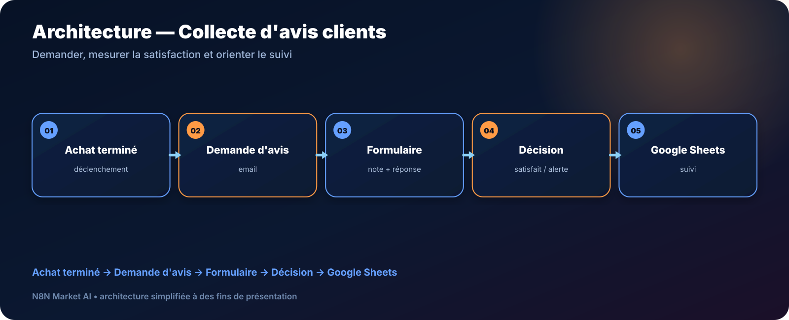

# Collecte automatique d'avis clients après achat — n8n

> **Un workflow pour demander un avis après une prestation ou un achat, distinguer les clients satisfaits des insatisfaits et centraliser les réponses.**

[**🛠️ Commander une version personnalisée — 29 € →**](https://n8nmarketai.com/products/collecte-automatique-d-avis-clients-apres-achat-workflow-n8n)

## 🛒 Offre N8N Market AI

| | |
|---|---|
| 💰 **Prix** | **29 €** |
| 📌 **Statut** | **🟠 BETA / PERSONNALISATION** |
| 📦 **Livraison** | Finalisation + validation avant livraison |
| 🧩 **Niveau** | Intermédiaire |
| ⏱️ **Installation estimée** | 30–60 min* |
| 🔧 **Personnalisation** | Disponible |

*Estimation hors récupération, création ou validation des accès externes.

---

## Pourquoi ce produit ?

Demander des avis au bon moment et traiter les retours négatifs demande une routine constante que les petites équipes ont rarement le temps de suivre.

Il vise à :
- déclencher une demande d’avis ;
- collecter une note et un commentaire ;
- orienter les clients satisfaits vers un avis public ;
- alerter l’équipe en cas d’insatisfaction ;
- journaliser les réponses.

## Pour qui ?

- e-commerçants ;
- prestataires de services ;
- commerces locaux ;
- équipes SAV ;
- entreprises qui veulent structurer la collecte d’avis.

## Avant / Après

| Avant | Avec le workflow |
|---|---|
| Demande d'avis oubliée | Déclenchement automatique |
| Même traitement pour tous | Branche selon la satisfaction |
| Retours négatifs vus trop tard | Alerte interne |
| Réponses dispersées | Suivi dans Sheets |
| Processus manuel | Routine reproductible |

## Architecture

**Achat terminé → Demande d'avis → Formulaire → Décision → Google Sheets**

## Fonctionnement cible

1. Déclencher la demande après l’événement métier.
2. Envoyer le lien de formulaire.
3. Recevoir la réponse.
4. Relier la réponse au bon client/achat.
5. Orienter selon la note.
6. Enregistrer le résultat.

## Cas d'usage

### Commerce local
Demander un avis après une prestation.

### E-commerce
Collecter la satisfaction après livraison.

### Service client
Détecter rapidement les réponses insatisfaites.

## ⚠️ À finaliser avant livraison

La version commerciale doit être finalisée et testée dans l’environnement du client, notamment :
- séparer proprement l’envoi de la demande et la réception du formulaire si deux triggers sont nécessaires ;
- transmettre un identifiant de commande/client dans un champ caché ;
- tester les scénarios simultanés ;
- documenter l’intégration avec la source d’achat ou de prestation.

## Limites

- ne publie pas un avis à la place du client ;
- pas de relance automatique des non-répondants dans cette version ;
- l’intégration Shopify/WooCommerce nécessite un déclencheur adapté ;
- la gestion des doublons doit être validée.

## 🛡️ Garde-fous recommandés

- identifiant unique pour relier la réponse ;
- alerte humaine pour les notes faibles ;
- journalisation ;
- aucune publication automatique d’avis ;
- credentials stockés dans n8n.

## 📦 Ce que vous recevez

Après finalisation :
- workflow finalisé ;
- structure du formulaire ;
- modèle Google Sheets ;
- configuration des branches satisfaction ;
- guide d’installation ;
- paramètres de délai personnalisables.

> Le fichier JSON commercial complet, les clés API et les credentials clients ne sont pas publiés dans ce dépôt.

## Prérequis

- n8n ;
- Gmail ou service email ;
- formulaire compatible ;
- Google Sheets ;
- Slack si l’alerte interne est conservée.

## FAQ

### Le workflow publie-t-il l'avis Google à la place du client ?
Non. Il peut inviter le client à publier son avis.

### Puis-je changer le délai après l'achat ?
Oui.

### Peut-on utiliser un autre formulaire que Typeform ?
Oui, avec adaptation.

### Que se passe-t-il en cas d'avis négatif ?
La version cible peut déclencher une alerte interne.

---

## Collectez les avis sans oublier les clients insatisfaits

[**🛠️ Commander la version personnalisée — 29 € →**](https://n8nmarketai.com/products/collecte-automatique-d-avis-clients-apres-achat-workflow-n8n)

[← Retour au catalogue N8N Market AI](../../README.md)
