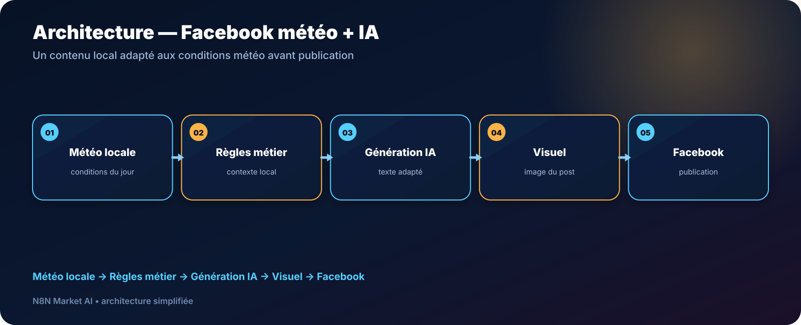

# Publication Facebook automatique selon la météo locale + IA — n8n

> **Un workflow qui récupère la météo locale, adapte le message grâce à l’IA et prépare une publication Facebook cohérente avec les conditions du jour.**

[**🛒 Acheter le workflow — 29 € →**](https://n8nmarketai.com/products/publication-facebook-auto-meteo-locale-ia-workflow-n8n)

## 🛒 Offre N8N Market AI

| | |
|---|---|
| 💰 **Prix** | **29 €** |
| 📌 **Statut** | **✅ LIVRABLE** |
| 📦 **Livraison** | Prêt à livrer après achat |
| 🧩 **Niveau** | Intermédiaire |
| ⏱️ **Installation estimée** | 30–60 min* |
| 🔧 **Personnalisation** | Ville, activité, ton et visuels |
| 📍 **Exemple d’origine** | Hannut, Belgique |

*Estimation hors création, validation ou récupération des accès aux services externes.

---

## Pourquoi ce produit ?

Les commerces locaux ont souvent besoin de publier régulièrement, mais un contenu générique peut manquer de contexte.

Ce workflow utilise la **météo réelle de la zone configurée** comme signal pour adapter le message du jour.

Il permet de :

- récupérer automatiquement les conditions météo locales ;
- transformer ces données en contexte marketing ;
- générer un texte adapté à l’activité ;
- associer un visuel ;
- publier sur Facebook selon la configuration ;
- réduire le travail répétitif de préparation du post.

## Pour qui ?

- commerces de proximité ;
- nettoyage automobile et carrosserie ;
- restaurants et cafés ;
- tourisme et loisirs ;
- jardiniers et services extérieurs ;
- toute activité dont le message peut utilement varier avec la météo.

## Avant / Après

| Avant | Avec le workflow |
|---|---|
| Chercher la météo manuellement | Récupération automatique |
| Rédiger le post chaque jour | Texte préparé avec l’IA |
| Contenu parfois déconnecté du contexte local | Message basé sur les conditions du jour |
| Même ton quelle que soit la météo | Angle adaptable pluie, soleil ou temps variable |
| Publication répétitive | Flux automatisé selon la configuration |

## Architecture

**Météo locale → Règles métier → Génération IA → Visuel → Facebook**

## Fonctionnement

1. **Lecture de la météo locale**  
   Le workflow interroge la source météo configurée.

2. **Normalisation du contexte**  
   Une valeur de secours peut être utilisée si certaines données ne sont pas disponibles.

3. **Génération du contenu**  
   L’IA prépare un message selon la météo, l’activité et le ton configurés.

4. **Association du visuel**  
   Le workflow utilise la source d’image prévue par la configuration.

5. **Publication Facebook**  
   Le contenu est transmis à Facebook via la méthode configurée pour l’environnement client.

## Cas d’usage

### Nettoyage automobile
Adapter le message selon pluie, soleil ou conditions variables.

### Restaurant
Mettre en avant terrasse, plats chauds ou offre du jour selon le contexte météo.

### Jardinage
Adapter les publications aux périodes sèches, pluvieuses ou aux besoins saisonniers.

### Activité touristique
Préparer un angle de communication cohérent avec les conditions locales.

## Personnalisation possible

- ville ou zone météo ;
- secteur d’activité ;
- style rédactionnel ;
- fréquence de publication ;
- logique de fallback météo ;
- source et sélection des visuels ;
- règles de publication Facebook.

## 🛡️ Garde-fous et fiabilité

- aucune clé API n’est publiée dans GitHub ;
- les credentials sont configurés dans n8n ;
- un fallback météo peut éviter l’affichage d’une variable vide ;
- les tokens et permissions Facebook doivent être configurés dans l’environnement du client ;
- le cycle de vie des autorisations Meta dépend de la configuration du compte et de l’application ;
- la publication doit être testée avec la page Facebook réelle avant mise en production.

## 📦 Ce que vous recevez

- le workflow n8n importable ;
- le guide d’installation ;
- la liste des services à connecter ;
- les paramètres de ville et de contenu à personnaliser ;
- les indications de configuration Facebook ;
- une base adaptable à votre activité locale.

## Prérequis

- n8n ;
- Google Sheets si utilisé par la configuration ;
- service météo compatible ;
- fournisseur IA ;
- accès à une page Facebook et aux autorisations nécessaires ;
- source de visuels selon la version livrée.

## FAQ

### Le workflow est-il limité à Hannut ?
Non. Hannut est l’exemple d’origine. La ville peut être remplacée par la zone du client.

### Peut-il changer de ton selon mon activité ?
Oui. Le prompt et les règles peuvent être personnalisés.

### Est-ce que le workflow gère les commentaires Facebook ?
Non. Cette version est centrée sur la préparation et la publication de contenu.

### Que se passe-t-il si la météo ne renvoie pas une donnée attendue ?
La configuration peut prévoir un fallback afin de fournir une valeur générique exploitable.

### Mes tokens Facebook sont-ils stockés dans GitHub ?
Non. Ils restent dans les credentials/configurations de l’environnement n8n.

---

## Faites parler votre contenu de ce qui se passe réellement autour de votre commerce

[**🛒 Acheter Facebook météo locale + IA — 29 € →**](https://n8nmarketai.com/products/publication-facebook-auto-meteo-locale-ia-workflow-n8n)

[← Retour au catalogue N8N Market AI](../../README.md)
