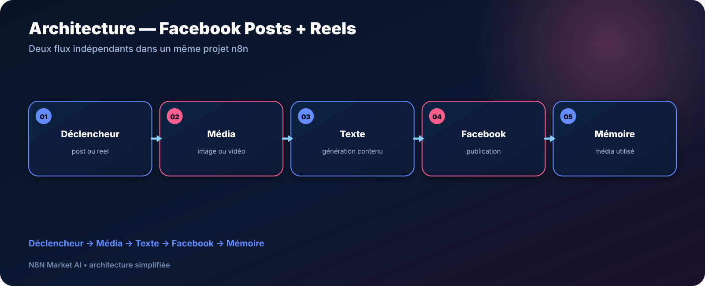

# Facebook Posts + Reels — Images, vidéos et contenu — n8n


> **Un seul projet n8n avec deux flux indépendants : publier des posts Facebook avec image et des Reels avec vidéo, tout en gardant une trace des médias utilisés.**

[**🛒 Acheter le workflow — 29 € →**](https://n8nmarketai.com/products/facebook-posts-reels-image-video-workflow-n8n)

## 🛒 Offre N8N Market AI

| | |
|---|---|
| 💰 **Prix** | **29 €** |
| 📌 **Statut** | **✅ LIVRABLE** |
| 📦 **Livraison** | Prêt à livrer après achat |
| 🧩 **Niveau** | Intermédiaire |
| ⏱️ **Installation estimée** | 30–60 min* |
| 🔧 **Personnalisation** | Textes, médias, fréquence et page |
| 🎬 **Formats** | Post image + Reel vidéo |

<sub>*Estimation hors création, validation ou récupération des accès aux services externes.</sub>

---

## Pourquoi ce produit ?

Gérer séparément les publications image et les Reels multiplie les tâches : choisir le média, préparer le texte, publier et conserver une trace de ce qui a déjà été utilisé.

Ce workflow réunit ces deux logiques dans un même projet n8n, tout en gardant des **branches indépendantes**.

## Pour qui ?

- commerces locaux ;
- créateurs de contenu ;
- agences social media ;
- indépendants ;
- marques publiant régulièrement sur Facebook ;
- équipes disposant déjà d’une bibliothèque d’images et de vidéos.

## Avant / Après

| Avant | Avec le workflow |
|---|---|
| Choisir manuellement chaque média | Sélection intégrée au flux |
| Préparer chaque légende séparément | Génération/préparation du texte dans n8n |
| Publier images et Reels avec deux routines | Deux branches dans un seul projet |
| Risque de perdre la trace des médias utilisés | Mémorisation prévue après publication |
| Processus difficile à reproduire | Workflow structuré et documenté |

## Architecture



**Déclencheur → Média → Texte → Facebook → Mémoire**

## Les deux branches

### 🖼️ Post Facebook

```text
Déclencheur Post
→ sélection image
→ génération / préparation du texte
→ publication Facebook image + texte
→ mémorisation de l'image utilisée
```

### 🎬 Reel Facebook

```text
Déclencheur Reel
→ sélection vidéo
→ génération / préparation du texte
→ publication Reel Facebook
→ mémorisation de la vidéo utilisée
```

## Cas d’usage

### Commerce local
Programmer régulièrement des images produits, coulisses ou offres.

### Salon / beauté
Alterner publications photo et vidéos courtes de réalisations.

### Agence
Utiliser une architecture réutilisable pour plusieurs clients après personnalisation.

### Créateur
Structurer une bibliothèque de médias et éviter de gérer chaque publication manuellement.

## Personnalisation possible

- source des images ;
- source des vidéos ;
- prompt et style du texte ;
- fréquence des déclencheurs ;
- page Facebook cible ;
- logique de sélection des médias ;
- système de mémorisation ;
- validation avant publication si souhaitée dans une version adaptée.

## 🛡️ Sécurité

La version préparée pour livraison ne contient pas :

- credentials enregistrés ;
- clés API ;
- tokens ;
- ID de page Facebook personnel ;
- IDs Data Table propres à l’instance d’origine ;
- `instanceId` n8n.

Les accès sont configurés dans l’environnement du client.

## 📦 Ce que vous recevez

- le workflow n8n importable ;
- les deux branches Post + Reel ;
- le guide d’installation ;
- les paramètres à configurer ;
- la liste des credentials nécessaires ;
- une base personnalisable pour vos médias et votre page.

> Le JSON commercial complet n’est pas publié publiquement dans ce dépôt.

## Prérequis

- n8n ;
- une page Facebook compatible avec la configuration ;
- les autorisations Meta nécessaires ;
- une source d’images ;
- une source de vidéos ;
- le fournisseur IA ou système de génération de texte prévu par la version livrée.

## FAQ

### Les Posts et les Reels sont-ils dans le même workflow ?
Oui. Le projet contient deux branches indépendantes.

### Puis-je utiliser mes propres images et vidéos ?
Oui. La source média fait partie des éléments personnalisables.

### Le workflow conserve-t-il une trace du média utilisé ?
La version décrite prévoit une étape de mémorisation après publication.

### Les tokens Facebook sont-ils inclus ?
Non. Les credentials restent propres à l’environnement client.

### Peut-on ajouter une validation manuelle ?
Oui, cela peut être prévu dans une personnalisation.

---

## Automatisez les deux formats Facebook les plus utiles dans un même projet

[**🛒 Acheter Facebook Posts + Reels — 29 € →**](https://n8nmarketai.com/products/facebook-posts-reels-image-video-workflow-n8n)

[← Retour au catalogue N8N Market AI](../../README.md)
