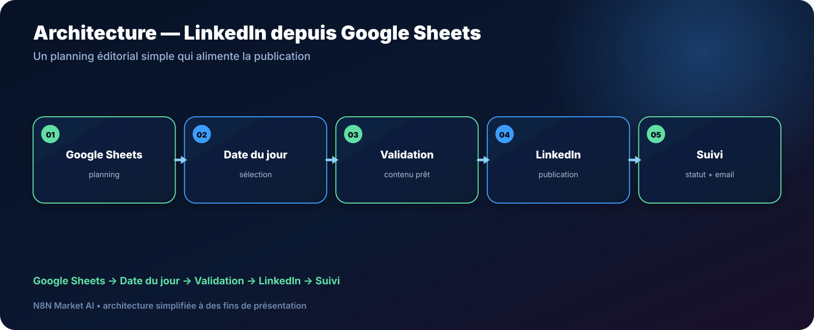

# Publication LinkedIn automatique depuis Google Sheets — n8n

> **Un workflow qui lit votre calendrier éditorial dans Google Sheets, sélectionne le contenu prévu et automatise sa publication LinkedIn.**

[**🛠️ Commander une version personnalisée — 29 € →**](https://n8nmarketai.com/products/publication-automatique-linkedin-depuis-google-sheets-workflow-n8n)

## 🛒 Offre N8N Market AI

| | |
|---|---|
| 💰 **Prix** | **29 €** |
| 📌 **Statut** | **🟠 BETA / PERSONNALISATION** |
| 📦 **Livraison** | Finalisation + validation avant livraison |
| 🧩 **Niveau** | Intermédiaire |
| ⏱️ **Installation estimée** | 20–45 min* |
| 🔧 **Personnalisation** | Disponible |

*Estimation hors récupération, création ou validation des accès externes.

---

## Pourquoi ce produit ?

Un planning éditorial dans Sheets reste inutile si quelqu’un doit encore copier-coller chaque publication manuellement au bon moment.

Il vise à :
- utiliser Google Sheets comme calendrier éditorial ;
- sélectionner la ligne du jour ;
- publier le contenu configuré ;
- mettre à jour le statut ;
- recevoir une confirmation ou une alerte.

## Pour qui ?

- community managers ;
- fondateurs ;
- solopreneurs ;
- petites équipes marketing ;
- professionnels qui planifient déjà leur contenu dans Sheets.

## Avant / Après

| Avant | Avec le workflow |
|---|---|
| Copier-coller le post | Lecture automatique de la ligne |
| Vérifier la date manuellement | Sélection selon le planning |
| Oublier une publication | Déclencheur planifié |
| Statut non mis à jour | Suivi dans Sheets |
| Erreur silencieuse | Notification prévue |

## Architecture

**Google Sheets → Date du jour → Validation → LinkedIn → Suivi**

## Fonctionnement cible

1. Lire le planning éditorial.
2. Identifier la ligne correspondant au jour/état attendu.
3. Vérifier que le contenu est publiable.
4. Publier via l’accès LinkedIn configuré.
5. Mettre à jour le statut uniquement en cas de succès.
6. Notifier le responsable.

## Cas d'usage

### Personal branding
Préparer les posts à l’avance dans une feuille simple.

### Petite équipe
Partager un planning éditorial sans outil supplémentaire.

### Agence
Adapter le modèle à différents calendriers clients.

## ⚠️ À finaliser avant livraison

La version commerciale doit être finalisée et testée dans l’environnement du client, notamment :
- définir précisément la méthode de recherche de la ligne du jour ;
- ajouter une gestion d’erreur avant de marquer un post comme publié ;
- vérifier le fuseau horaire de l’instance n8n ;
- tester les permissions LinkedIn utilisées.

## Limites

- version standard centrée sur le texte ;
- pas de publication vidéo/image dans la conception actuelle ;
- la configuration visée concerne un profil compatible avec l’accès API retenu ;
- le contenu doit être préparé dans Sheets.

## 🛡️ Garde-fous recommandés

- ne jamais marquer publié si l’appel LinkedIn échoue ;
- journalisation des erreurs ;
- credentials OAuth stockés dans n8n ;
- contrôle de la date et du statut avant publication.

## 📦 Ce que vous recevez

Après finalisation :
- workflow finalisé ;
- modèle de Google Sheets ;
- guide OAuth LinkedIn ;
- configuration horaire ;
- emails de confirmation/alerte ;
- documentation des colonnes.

> Le fichier JSON commercial complet, les clés API et les credentials clients ne sont pas publiés dans ce dépôt.

## Prérequis

- n8n ;
- Google Sheets ;
- Gmail si les notifications sont conservées ;
- accès LinkedIn compatible ;
- credentials OAuth.

## FAQ

### Le workflow crée-t-il le texte du post ?
Pas dans la version standard décrite ; le contenu vient de Google Sheets.

### Puis-je changer l'heure de publication ?
Oui.

### Gère-t-il les images ?
Pas dans cette conception standard.

### Le statut est-il mis à jour automatiquement ?
La version finale doit le faire uniquement après publication réussie.

---

## Transformez votre Google Sheet en calendrier LinkedIn automatisé

[**🛠️ Commander la version personnalisée — 29 € →**](https://n8nmarketai.com/products/publication-automatique-linkedin-depuis-google-sheets-workflow-n8n)

[← Retour au catalogue N8N Market AI](../../README.md)
