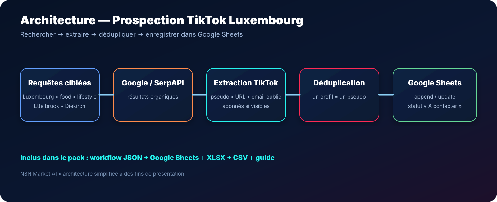

# Prospection TikTok Luxembourg — SerpAPI + Google Sheets — n8n

> **Un workflow n8n pour rechercher des profils TikTok liés au Luxembourg via Google/SerpAPI, extraire les comptes détectés, éviter les doublons et centraliser les prospects dans Google Sheets.**

[**🛒 Acheter le workflow — 9,99 € →**](https://n8nmarketai.com/products/prospection-tiktok-luxembourg-serpapi-google-sheets-workflow-n8n)

## 🛒 Offre N8N Market AI

| | |
|---|---|
| 💰 **Prix** | **9,99 €** |
| 📌 **Statut** | **🟢 PUBLIABLE** |
| 📦 **Livraison** | Workflow + modèle Sheets + fichiers XLSX/CSV |
| 🧩 **Niveau** | Facile à intermédiaire |
| 🔧 **Personnalisation** | Requêtes, zones, secteurs et statuts |
| 🌍 **Zone d'origine** | Luxembourg |

---

## Pourquoi ce produit ?

Trouver des créateurs, influenceurs ou comptes TikTok locaux peut demander beaucoup de recherches manuelles.

Ce workflow automatise une première phase de prospection en utilisant **Google + SerpAPI** pour repérer les profils TikTok correspondant à des requêtes ciblées.

Il permet de :

- lancer plusieurs recherches TikTok ciblées ;
- couvrir notamment Luxembourg, Ettelbruck et Diekirch ;
- rechercher des profils food, restaurant, lifestyle ou influence ;
- extraire automatiquement le pseudo TikTok ;
- construire l'URL du profil ;
- récupérer un email public lorsqu'il apparaît dans les résultats Google ;
- récupérer une indication d'abonnés lorsque Google l'affiche ;
- dédupliquer les profils ;
- enregistrer le résultat dans Google Sheets.

## Architecture

**Requêtes ciblées → Google/SerpAPI → Extraction TikTok → Déduplication → Google Sheets**

## Google Sheets inclus

Le pack contient un tableau prêt à l'emploi avec les colonnes :

| Colonne | Utilisation |
|---|---|
| `pseudo` | Handle TikTok |
| `profil_url` | URL du profil |
| `titre` | Titre du résultat Google |
| `description` | Snippet du résultat |
| `abonnes` | Nombre d'abonnés quand visible |
| `email_bio` | Email public détecté |
| `requete_source` | Recherche qui a trouvé le profil |
| `date_ajout` | Date d'ajout |
| `statut` | Suivi commercial |

Statuts proposés : **À contacter, Contacté, Répondu, Intéressé, Refus, Partenariat**.

## Ce que vous recevez

- workflow n8n commercial sans credentials personnels ;
- modèle Google Sheets natif ;
- fichier Excel `.xlsx` ;
- modèle `.csv` ;
- guide de configuration ;
- pack ZIP.

## Prérequis

- n8n ;
- compte SerpAPI ;
- compte Google Sheets ;
- credentials configurés dans n8n.

## Limites

- ce workflow n'utilise pas l'API officielle TikTok ;
- les résultats dépendent de l'indexation Google ;
- le nombre d'abonnés n'est disponible que si Google l'affiche dans le résultat ;
- l'email n'est détecté que s'il apparaît publiquement dans le snippet ;
- les profils peuvent nécessiter une vérification humaine avant contact.

## Sécurité

- aucune clé SerpAPI n'est publiée dans GitHub ;
- aucun credential Google personnel n'est inclus ;
- aucun `instanceId` n'est livré dans la version commerciale ;
- les credentials sont configurés directement dans n8n.

## FAQ

### Peut-on chercher d'autres villes ?
Oui. Les requêtes sont modifiables.

### Peut-on utiliser ce workflow pour la Belgique ou la France ?
Oui. Il suffit d'adapter les requêtes et paramètres Google.

### Est-ce que le workflow contacte automatiquement les profils ?
Non. Il construit une liste de prospection dans Google Sheets.

### Est-ce que les doublons sont supprimés ?
Oui, la logique regroupe les résultats par pseudo TikTok.

---

## Construisez votre liste TikTok locale automatiquement

[**🛒 Acheter Prospection TikTok Luxembourg — 9,99 € →**](https://n8nmarketai.com/products/prospection-tiktok-luxembourg-serpapi-google-sheets-workflow-n8n)

[← Retour au catalogue N8N Market AI](../../README.md)
