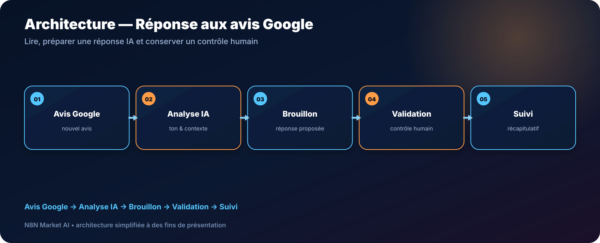

# Réponse assistée par IA aux avis Google Business — n8n

> **Un workflow pour détecter de nouveaux avis Google, préparer une réponse adaptée avec l’IA et conserver une validation humaine avant publication.**

[**🛠️ Commander une version personnalisée — 29 € →**](https://n8nmarketai.com/products/reponse-automatique-aux-avis-google-business-avec-ia-workflow-n8n)

## 🛒 Offre N8N Market AI

| | |
|---|---|
| 💰 **Prix** | **29 €** |
| 📌 **Statut** | **🟠 BETA / PERSONNALISATION** |
| 📦 **Livraison** | Finalisation + validation avant livraison |
| 🧩 **Niveau** | Intermédiaire |
| ⏱️ **Installation estimée** | 30–60 min* |
| 🔧 **Personnalisation** | Disponible |

*Estimation hors récupération, création ou validation des accès externes.

---

## Pourquoi ce produit ?

Répondre régulièrement aux avis demande du temps, mais automatiser sans contrôle peut produire une réponse inadaptée. Cette version premium privilégie une approche assistée.

Il vise à :
- récupérer les nouveaux avis ;
- analyser le ton et le contenu ;
- préparer une réponse personnalisée ;
- faire valider la réponse ;
- conserver un suivi.

## Pour qui ?

- restaurants ;
- salons ;
- artisans ;
- boutiques locales ;
- gestionnaires d’e-réputation.

## Avant / Après

| Avant | Avec le workflow |
|---|---|
| Avis vérifiés manuellement | Collecte automatisée |
| Réponse écrite de zéro | Brouillon IA |
| Risque de réponse générique | Contexte de l'avis analysé |
| Publication automatique risquée | Validation humaine |
| Suivi dispersé | Récapitulatif |

## Architecture

**Avis Google → Analyse IA → Brouillon → Validation → Suivi**

## Fonctionnement cible

1. Récupérer les avis nouveaux.
2. Préparer le contexte pour l’IA.
3. Générer une proposition de réponse.
4. Soumettre à validation humaine.
5. Publier seulement selon la règle retenue.
6. Regrouper le suivi dans un récapitulatif.

## Cas d'usage

### Commerce local
Préparer rapidement des réponses cohérentes.

### Restaurant
Adapter le ton selon la note et le commentaire.

### Agence
Centraliser la préparation des réponses pour plusieurs clients après adaptation.

## ⚠️ À finaliser avant livraison

La version commerciale doit être finalisée et testée dans l’environnement du client, notamment :
- séparer clairement la fréquence de collecte et le récapitulatif quotidien ;
- utiliser une boucle propre pour traiter plusieurs avis ;
- agréger les résultats avant l’email récapitulatif ;
- ajouter une étape d’approbation humaine avant publication ;
- tester les accès Google Business requis.

## Limites

- l’IA peut mal interpréter ironie ou sarcasme ;
- pas de traitement natif des signalements d’avis frauduleux ;
- pas d’historique CRM client par défaut ;
- traduction multilingue non incluse par défaut.

## 🛡️ Garde-fous recommandés

- validation humaine avant publication ;
- aucune réponse si l’IA échoue ;
- journalisation des avis traités ;
- credentials dans n8n ;
- possibilité d’exclure les notes sensibles de l’automatisation.

## 📦 Ce que vous recevez

Après finalisation :
- workflow finalisé ;
- prompt de réponse personnalisable ;
- règles de validation ;
- guide Google Business ;
- récapitulatif email ;
- documentation d’installation.

> Le fichier JSON commercial complet, les clés API et les credentials clients ne sont pas publiés dans ce dépôt.

## Prérequis

- n8n ;
- accès Google Business/Google Cloud compatible ;
- fournisseur IA ;
- Gmail ou autre canal de notification.

## FAQ

### Les réponses sont-elles publiées automatiquement ?
La version premium prévue privilégie une validation humaine avant publication.

### Puis-je adapter le ton ?
Oui.

### Peut-on exclure les avis très négatifs ?
Oui, une règle de traitement manuel peut être ajoutée.

### L’IA comprend-elle toujours le sarcasme ?
Non. C’est une raison supplémentaire de conserver une validation humaine.

---

## Répondez plus vite tout en gardant le dernier mot

[**🛠️ Commander la version personnalisée — 29 € →**](https://n8nmarketai.com/products/reponse-automatique-aux-avis-google-business-avec-ia-workflow-n8n)

[← Retour au catalogue N8N Market AI](../../README.md)
