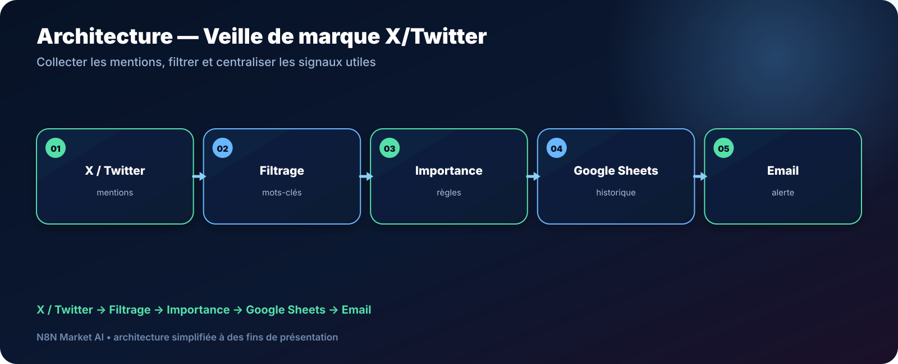

# Veille de marque X/Twitter vers Google Sheets — n8n

> **Un workflow pour centraliser les mentions de marque disponibles via l’API X/Twitter, appliquer des règles d’importance et alerter uniquement lorsqu’un signal mérite votre attention.**

[**🛠️ Commander une version personnalisée — 29 € →**](https://n8nmarketai.com/products/veille-marque-automatique-twitter-x-vers-google-sheets-workflow-n8n)

## 🛒 Offre N8N Market AI

| | |
|---|---|
| 💰 **Prix** | **29 €** |
| 📌 **Statut** | **🟠 BETA / PERSONNALISATION** |
| 📦 **Livraison** | Finalisation + validation avant livraison |
| 🧩 **Niveau** | Intermédiaire |
| ⏱️ **Installation estimée** | 30–60 min* |
| 🔧 **Personnalisation** | Disponible |

*Estimation hors récupération, création ou validation des accès externes.

---

## Pourquoi ce produit ?

Suivre manuellement les conversations autour d’une marque est difficile à tenir dans la durée. Une veille automatisée aide à centraliser les signaux dans un tableau exploitable.

Il vise à :
- collecter les mentions accessibles ;
- filtrer par mots-clés ;
- appliquer des règles d’importance ;
- historiser dans Google Sheets ;
- déclencher une alerte email.

## Pour qui ?

- petites marques ;
- community managers ;
- agences ;
- entrepreneurs ;
- équipes qui suivent leur e-réputation sur X/Twitter.

## Avant / Après

| Avant | Avec le workflow |
|---|---|
| Recherche manuelle | Collecte planifiée |
| Mentions dispersées | Centralisation dans Sheets |
| Tout semble urgent | Règles d'importance |
| Risque de rater un signal | Alerte ciblée |
| Peu d'historique | Journalisation |

## Architecture

**X / Twitter → Filtrage → Importance → Google Sheets → Email**

## Fonctionnement cible

1. Interroger l’accès API configuré.
2. Filtrer les résultats selon la marque et les règles.
3. Comparer avec l’historique.
4. Enregistrer les nouvelles mentions.
5. Déclencher une alerte pour les signaux importants.

## Cas d'usage

### Petite marque
Conserver un historique simple des mentions.

### Community manager
Recevoir une alerte lorsque certaines règles sont remplies.

### Agence
Créer une base de veille adaptée à un client.

## ⚠️ À finaliser avant livraison

La version commerciale doit être finalisée et testée dans l’environnement du client, notamment :
- vérifier l’offre et les permissions API X disponibles au moment de l’installation ;
- remplacer les anciennes boucles par une logique Loop adaptée à la version n8n utilisée ;
- optimiser la déduplication Google Sheets ;
- tester les limites de fréquence de l’API du compte client.

## Limites

- dépend fortement des capacités et conditions actuelles de l’API X ;
- ne couvre pas automatiquement Instagram, TikTok ou Facebook ;
- les règles de sentiment simples peuvent manquer de nuance ;
- une publication supprimée peut rester dans l’historique.

## 🛡️ Garde-fous recommandés

- déduplication ;
- limite du nombre de requêtes ;
- journalisation ;
- règles d’alerte configurables ;
- credentials API conservés dans n8n.

## 📦 Ce que vous recevez

Après finalisation :
- workflow finalisé ;
- structure Google Sheets ;
- règles de filtre ;
- configuration email ;
- guide API X ;
- documentation d’installation.

> Le fichier JSON commercial complet, les clés API et les credentials clients ne sont pas publiés dans ce dépôt.

## Prérequis

- n8n ;
- accès API X/Twitter compatible ;
- Google Sheets ;
- Gmail ou SMTP.

## FAQ

### Le workflow fonctionne-t-il sans accès API X ?
Non. Il dépend d’un accès compatible.

### Peut-il surveiller Instagram aussi ?
Pas dans cette version standard.

### Puis-je changer les règles d’alerte ?
Oui.

### Les mentions sont-elles dédupliquées ?
La version finale doit intégrer cette logique.

---

## Centralisez votre veille de marque dans un tableau exploitable

[**🛠️ Commander la version personnalisée — 29 € →**](https://n8nmarketai.com/products/veille-marque-automatique-twitter-x-vers-google-sheets-workflow-n8n)

[← Retour au catalogue N8N Market AI](../../README.md)
