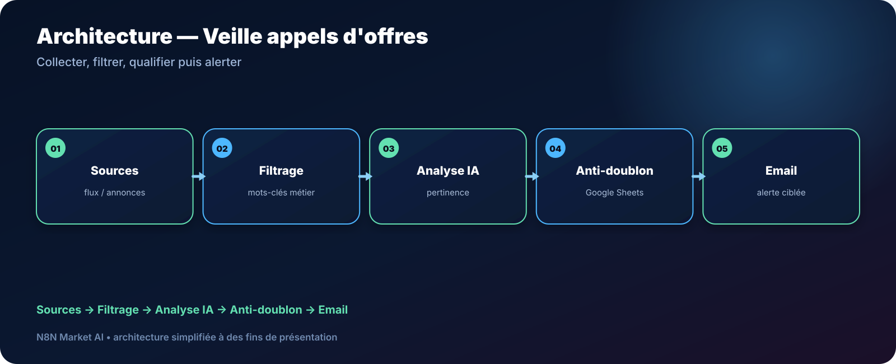

# Veille IA des appels d'offres publics par email — n8n

> **Un workflow pour collecter des annonces, filtrer selon vos mots-clés métier, évaluer leur pertinence et envoyer uniquement les opportunités à examiner.**

[**🛠️ Commander une version personnalisée — 29 € →**](https://n8nmarketai.com/products/alerte-ia-appels-d-offres-publics-par-email-workflow-n8n)

## 🛒 Offre N8N Market AI

| | |
|---|---|
| 💰 **Prix** | **29 €** |
| 📌 **Statut** | **🟠 BETA / PERSONNALISATION** |
| 📦 **Livraison** | Finalisation + validation avant livraison |
| 🧩 **Niveau** | Intermédiaire |
| ⏱️ **Installation estimée** | 30–60 min* |
| 🔧 **Personnalisation** | Disponible |

*Estimation hors récupération, création ou validation des accès externes.

---

## Pourquoi ce produit ?

Surveiller manuellement plusieurs sources d'appels d'offres prend du temps et augmente le risque de passer à côté d'une annonce pertinente.

Il vise à :
- centraliser la veille ;
- filtrer par métier et mots-clés ;
- qualifier la pertinence avec l’IA ;
- éviter les doublons ;
- envoyer une alerte ciblée par email.

## Pour qui ?

- artisans ;
- TPE ;
- consultants indépendants ;
- petites équipes commerciales ;
- entreprises qui répondent ponctuellement à des marchés publics.

## Avant / Après

| Avant | Avec le workflow |
|---|---|
| Consulter les sources une par une | Collecte automatisée |
| Lire toutes les annonces | Préfiltrage par critères |
| Décider manuellement de la pertinence | Analyse IA selon les règles |
| Risque d'alerte en double | Mémoire anti-doublon |
| Veille irrégulière | Routine planifiée |

## Architecture

**Sources → Filtrage → Analyse IA → Anti-doublon → Email**

## Fonctionnement cible

1. Lire les sources configurées.
2. Filtrer les annonces selon les mots-clés métier.
3. Préparer un contexte réduit pour l’analyse IA.
4. Évaluer la pertinence.
5. Vérifier l’identifiant dans Google Sheets.
6. Envoyer l’alerte si l’annonce est nouvelle et pertinente.

## Cas d'usage

### Artisan du bâtiment
Suivre les annonces correspondant à ses spécialités sans consulter chaque portail manuellement.

### Consultant
Recevoir une sélection ciblée selon quelques mots-clés d'expertise.

### TPE
Conserver dans Sheets l’historique des annonces déjà examinées.

## ⚠️ À finaliser avant livraison

La version commerciale doit être finalisée et testée dans l’environnement du client, notamment :
- nettoyer/reconstruire l’export JSON de référence ;
- valider le parsing des sources réellement utilisées ;
- fournir un modèle Google Sheets pour l’anti-doublon ;
- limiter la quantité de texte envoyée au modèle IA ;
- tester la pertinence des critères avec le client.

## Limites

- ne télécharge pas automatiquement tous les dossiers de consultation ;
- ne candidate pas à la place de l’entreprise ;
- la couverture dépend des sources configurées ;
- la pertinence dépend des mots-clés et règles définis.

## 🛡️ Garde-fous recommandés

- anti-doublon avant envoi ;
- limite de taille du contenu analysé ;
- journalisation des alertes ;
- credentials stockés dans n8n ;
- validation des sources avant mise en production.

## 📦 Ce que vous recevez

Après finalisation :
- workflow n8n finalisé ;
- guide de configuration ;
- modèle Google Sheets ;
- mots-clés et règles personnalisés ;
- configuration email ;
- documentation des sources utilisées.

> Le fichier JSON commercial complet, les clés API et les credentials clients ne sont pas publiés dans ce dépôt.

## Prérequis

- n8n ;
- source(s) d’appels d’offres compatibles ;
- Google Sheets ;
- Gmail ou SMTP ;
- fournisseur IA.

## FAQ

### Le workflow répond-il automatiquement aux appels d'offres ?
Non. Il sert à détecter et prioriser les annonces.

### Puis-je changer les mots-clés ?
Oui. Ils sont personnalisables.

### Évite-t-il les doublons ?
La version finale doit utiliser Google Sheets comme mémoire anti-doublon.

### Peut-on ajouter d'autres sources ?
Oui, si elles disposent d’un accès exploitable par n8n.

---

## Ne laissez plus votre veille dépendre d'une vérification manuelle

[**🛠️ Commander la version personnalisée — 29 € →**](https://n8nmarketai.com/products/alerte-ia-appels-d-offres-publics-par-email-workflow-n8n)

[← Retour au catalogue N8N Market AI](../../README.md)
