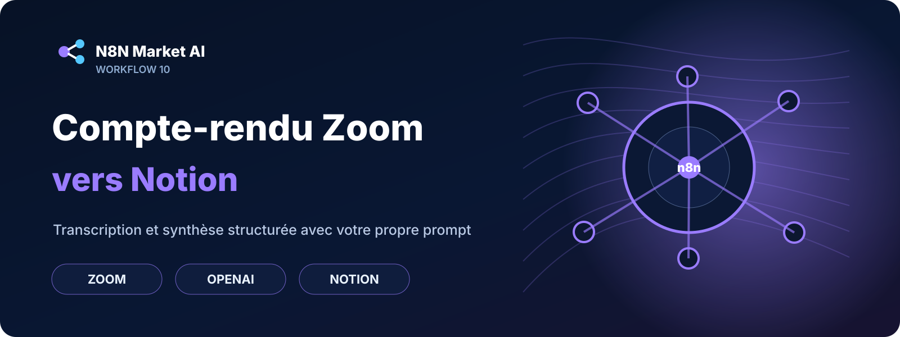

# Compte-rendu Zoom vers Notion avec prompt personnalisé

## 🛒 Offre N8N Market AI

| | |
|---|---|
| 💰 **Prix** | **29 €** |
| 📌 **Statut** | **🟠 BETA / PERSONNALISATION** |
| 📦 **Livraison** | Personnalisation + validation avant livraison |
| 🧩 **Niveau** | Avancé |
| ⏱️ **Installation estimée** | 45–90 min* |
| 🔧 **Personnalisation** | Disponible |

[**🛠️ Commander une version personnalisée →**](https://n8nmarketai.com/)

*Estimation hors création, validation ou récupération des accès aux services externes.

## 📦 Ce que vous recevez

- une version finalisée et adaptée à votre environnement ;
- le workflow n8n importable après validation ;
- le guide de configuration ;
- la liste des comptes, API et credentials à connecter ;
- les paramètres à personnaliser.

> Le fichier JSON commercial complet, les clés API et les credentials clients ne sont pas publiés sur GitHub.

Les consultants et chefs de projet perdent jusqu’à deux heures après chaque appel client à retranscrire, structurer et mettre en page un compte-rendu exploitable. Les outils SaaS comme Fathom ou Fireflies produisent un format figé sans aucun contrôle sur la structure ni sur le prompt. Ce workflow crée automatiquement une page Notion parfaitement structurée selon votre propre prompt et votre mise en page exacte.

## Pour qui ?

Consultants indépendants et petites agences qui facturent au temps et qui veulent arrêter de perdre des heures sur les comptes-rendus.

## Prérequis

Connectez votre compte Zoom (webhook + Cloud Recordings), OpenAI et Notion.

## Version commerciale

Le fichier JSON n8n complet reste privé. Le pack commercial est prévu pour inclure le workflow importable, les instructions de configuration et les paramètres à personnaliser.

## Validation technique

La fiche de conception indique que ce workflow doit encore être retravaillé avant commercialisation.

**Point principal à corriger :** Le code JSON du workflow est totalement absent. Il faut absolument integrer un decoupage du fichier audio car le simple avertissement propose pour la limite de 25 Mo de Whisper rendra le template inoperant. Il manque aussi un systeme de retry pour palier le delai de disponibilite du fichier chez Zoom.

## Limites

le workflow ne fonctionne qu'avec les enregistrements Zoom Cloud, pas les enregistrements locaux. Il ne détecte pas automatiquement les locuteurs, la diarisation n'est pas incluse. Il ne relit pas les pages Notion existantes ni ne fusionne plusieurs réunions. Le coût Whisper d'environ 0,006 dollar par minute audio est réel et à la charge de l'utilisateur.

## Tags

compte-rendu, notion, zoom, prompt personnalisé, réunion

---

[← Retour au catalogue N8N Market AI](../../README.md)
