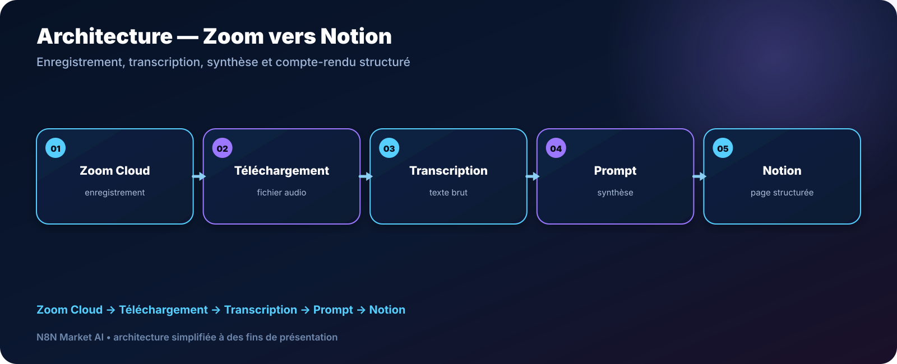

# Compte-rendu Zoom vers Notion avec prompt personnalisé — n8n

> **Un workflow pour récupérer un enregistrement Zoom Cloud, le transcrire, appliquer votre propre prompt de synthèse et créer une page Notion structurée.**

[**🛠️ Commander une version personnalisée — 29 € →**](https://n8nmarketai.com/products/compte-rendu-zoom-vers-notion-avec-prompt-personnalise-workflow-n8n)

## 🛒 Offre N8N Market AI

| | |
|---|---|
| 💰 **Prix** | **29 €** |
| 📌 **Statut** | **🟠 BETA / PERSONNALISATION** |
| 📦 **Livraison** | Finalisation + validation avant livraison |
| 🧩 **Niveau** | Avancé |
| ⏱️ **Installation estimée** | 45–90 min* |
| 🔧 **Personnalisation** | Disponible |

*Estimation hors récupération, création ou validation des accès externes.

---

## Pourquoi ce produit ?

Après une réunion client, la transcription et la mise en forme d’un compte-rendu peuvent devenir un travail répétitif, surtout lorsque l’équipe souhaite conserver une structure précise.

Il vise à :
- récupérer l’enregistrement automatiquement ;
- transcrire l’audio ;
- appliquer votre propre structure de compte-rendu ;
- créer une page Notion ;
- standardiser les livrables de réunion.

## Pour qui ?

- consultants ;
- chefs de projet ;
- petites agences ;
- équipes utilisant Zoom Cloud et Notion ;
- professionnels qui veulent contrôler le format final.

## Avant / Après

| Avant | Avec le workflow |
|---|---|
| Télécharger l'enregistrement manuellement | Récupération automatisée |
| Transcrire à la main | Transcription automatique |
| Réécrire le compte-rendu | Synthèse par prompt |
| Copier dans Notion | Création de page structurée |
| Formats variables | Structure reproductible |

## Architecture

**Zoom Cloud → Téléchargement → Transcription → Prompt → Notion**

## Fonctionnement cible

1. Recevoir l’événement Zoom approprié.
2. Attendre que l’enregistrement soit disponible.
3. Télécharger le fichier avec l’autorisation adéquate.
4. Transcrire l’audio.
5. Appliquer le prompt personnalisé.
6. Créer la page Notion.

## Cas d'usage

### Consultant
Créer un compte-rendu client dans son format standard.

### Agence
Uniformiser les comptes-rendus de réunions de projet.

### Équipe interne
Centraliser les décisions et actions dans Notion.

## ⚠️ À finaliser avant livraison

La version commerciale doit être finalisée et testée dans l’environnement du client, notamment :
- construire/revalider le JSON complet ;
- gérer le délai de disponibilité des enregistrements Zoom avec retry ;
- prévoir un traitement pour les fichiers audio volumineux ;
- valider les permissions OAuth Zoom nécessaires ;
- tester la création de page Notion avec la structure du client.

## Limites

- centré sur Zoom Cloud dans cette conception ;
- pas de diarisation avancée prévue par défaut ;
- ne fusionne pas automatiquement plusieurs réunions ;
- les coûts de transcription/IA dépendent du fournisseur choisi.

## 🛡️ Garde-fous recommandés

- retry contrôlé avant abandon ;
- validation du fichier téléchargé ;
- limite de taille et stratégie de découpage ;
- credentials OAuth stockés dans n8n ;
- journalisation des erreurs.

## 📦 Ce que vous recevez

Après finalisation :
- workflow finalisé ;
- guide Zoom OAuth ;
- prompt de compte-rendu personnalisable ;
- structure Notion adaptée ;
- guide d’installation ;
- paramètres de transcription.

> Le fichier JSON commercial complet, les clés API et les credentials clients ne sont pas publiés dans ce dépôt.

## Prérequis

- n8n ;
- Zoom Cloud Recordings ;
- Notion ;
- fournisseur de transcription/IA ;
- credentials OAuth appropriés.

## FAQ

### Puis-je choisir mon propre format de compte-rendu ?
Oui. C’est l’un des objectifs principaux du workflow.

### Fonctionne-t-il avec un enregistrement local ?
La conception actuelle cible Zoom Cloud.

### Peut-il reconnaître automatiquement chaque intervenant ?
Pas dans la version standard prévue.

### Pourquoi faut-il gérer les gros fichiers ?
Les services de transcription imposent des limites qui doivent être prises en compte dans la version finale.

---

## Transformez vos réunions en comptes-rendus structurés

[**🛠️ Commander la version personnalisée — 29 € →**](https://n8nmarketai.com/products/compte-rendu-zoom-vers-notion-avec-prompt-personnalise-workflow-n8n)

[← Retour au catalogue N8N Market AI](../../README.md)
