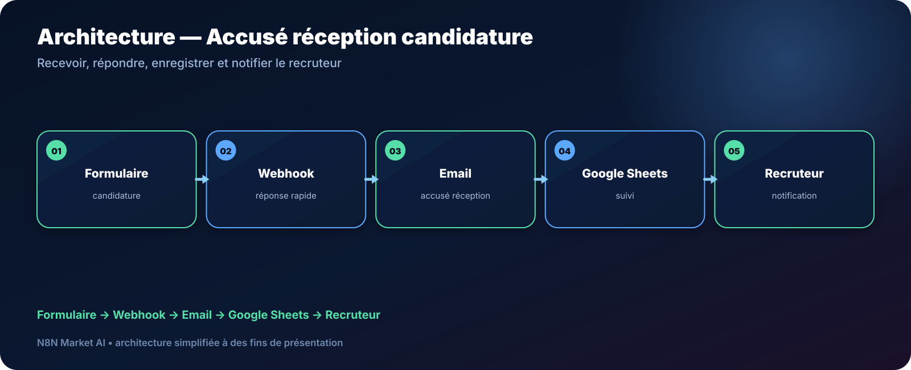

# Accusé de réception automatique des candidatures — n8n

> **Un workflow pour répondre immédiatement à une candidature, enregistrer le dossier dans Google Sheets et notifier le recruteur.**

[**🛠️ Commander une version personnalisée — 29 € →**](https://n8nmarketai.com/products/accuse-reception-automatique-candidature-formulaire-workflow-n8n)

## 🛒 Offre N8N Market AI

| | |
|---|---|
| 💰 **Prix** | **29 €** |
| 📌 **Statut** | **🟠 BETA / PERSONNALISATION** |
| 📦 **Livraison** | Finalisation + validation avant livraison |
| 🧩 **Niveau** | Facile à intermédiaire |
| ⏱️ **Installation estimée** | 20–40 min* |
| 🔧 **Personnalisation** | Disponible |

*Estimation hors récupération, création ou validation des accès externes.

---

## Pourquoi ce produit ?

Un candidat qui soumet un formulaire attend au minimum une confirmation claire. Automatiser cette première réponse améliore la régularité du processus RH.

Il vise à :
- répondre immédiatement ;
- enregistrer la candidature ;
- notifier le recruteur ;
- centraliser le suivi ;
- standardiser l’expérience candidat.

## Pour qui ?

- PME ;
- recruteurs indépendants ;
- services RH ;
- associations ;
- entreprises recevant les candidatures via formulaire.

## Avant / Après

| Avant | Avec le workflow |
|---|---|
| Réponse manuelle | Accusé automatique |
| Candidature copiée à la main | Enregistrement dans Sheets |
| Recruteur non averti | Notification |
| Suivi dispersé | Tableau centralisé |
| Formulaire pouvant attendre trop longtemps | Réponse webhook rapide |

## Architecture

**Formulaire → Webhook → Email → Google Sheets → Recruteur**

## Fonctionnement cible

1. Recevoir la candidature via webhook.
2. Répondre rapidement au formulaire.
3. Envoyer l’accusé de réception.
4. Créer la ligne de suivi.
5. Notifier le recruteur.

## Cas d'usage

### Petite entreprise
Répondre proprement à chaque candidature reçue.

### Cabinet
Centraliser les nouveaux dossiers dans une feuille.

### Association
Mettre en place un suivi simple sans ATS.

## ⚠️ À finaliser avant livraison

- documenter précisément les colonnes Google Sheets ;
- placer la réponse webhook suffisamment tôt pour éviter les timeouts ;
- définir la gestion des pièces jointes privées ;
- tester les champs obligatoires du formulaire.

## Limites

- ne lit pas le contenu du CV dans cette version ;
- ne score pas les candidats ;
- ne remplace pas un ATS complet ;
- les relances recruteur ne sont pas prévues par défaut.

## 🛡️ Garde-fous recommandés

- validation des champs entrants ;
- aucune donnée sensible dans GitHub ;
- journalisation ;
- gestion d’erreur email ;
- stockage des credentials dans n8n.

## 📦 Ce que vous recevez

Après finalisation :
- workflow finalisé ;
- modèle Google Sheets ;
- template d’accusé de réception ;
- guide webhook ;
- configuration notification ;
- documentation des champs.

> Le fichier JSON commercial complet, les clés API et les credentials clients ne sont pas publiés dans ce dépôt.

## Prérequis

- n8n ;
- formulaire ou webhook ;
- Google Sheets ;
- Gmail ou service email.

## FAQ

### Le workflow analyse-t-il le CV ?
Non, ce produit est centré sur l’accusé de réception et le suivi.

### Peut-on personnaliser l’email ?
Oui.

### Fonctionne-t-il avec n’importe quel formulaire ?
Oui si le formulaire peut envoyer ses données vers un webhook compatible.

### Remplace-t-il un ATS ?
Non. Il s’agit d’une automatisation légère.

---

## Donnez une réponse immédiate à chaque candidature

[**🛠️ Commander la version personnalisée — 29 € →**](https://n8nmarketai.com/products/accuse-reception-automatique-candidature-formulaire-workflow-n8n)

[← Retour au catalogue N8N Market AI](../../README.md)
