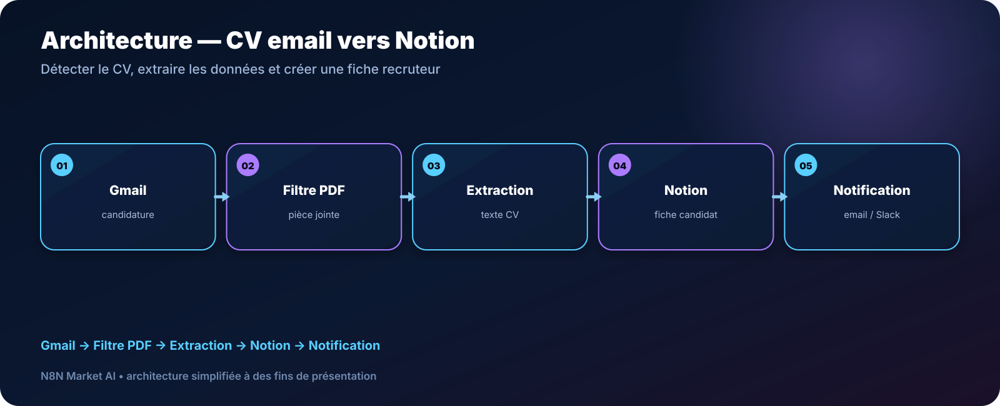

# Tri automatique des CV par email vers Notion — n8n

> **Un workflow pour détecter les CV reçus par email, extraire les informations clés et créer une fiche structurée dans Notion.**

[**🛠️ Commander une version personnalisée — 29 € →**](https://n8nmarketai.com/products/tri-automatique-des-cv-par-email-vers-notion-workflow-n8n)

## 🛒 Offre N8N Market AI

| | |
|---|---|
| 💰 **Prix** | **29 €** |
| 📌 **Statut** | **🟠 BETA / PERSONNALISATION** |
| 📦 **Livraison** | Finalisation + validation avant livraison |
| 🧩 **Niveau** | Intermédiaire |
| ⏱️ **Installation estimée** | 30–60 min* |
| 🔧 **Personnalisation** | Disponible |

*Estimation hors récupération, création ou validation des accès externes.

---

## Pourquoi ce produit ?

Copier manuellement les informations des CV vers un tableau de suivi prend du temps et produit des fiches incohérentes.

Il vise à :
- détecter les candidatures ;
- isoler les pièces jointes PDF ;
- extraire les informations utiles ;
- créer une fiche Notion ;
- notifier l’équipe ;
- conserver le document original selon la version finale.

## Pour qui ?

- recruteurs ;
- PME ;
- cabinets ;
- services RH ;
- équipes utilisant Notion pour le suivi candidat.

## Avant / Après

| Avant | Avec le workflow |
|---|---|
| Ouvrir chaque email | Détection automatisée |
| Copier les informations du CV | Extraction structurée |
| Créer la fiche à la main | Création Notion |
| CV original difficile à retrouver | Archivage prévu |
| Aucune notification | Alerte équipe |

## Architecture

**Gmail → Filtre PDF → Extraction → Notion → Notification**

## Fonctionnement cible

1. Détecter un email de candidature.
2. Vérifier la présence d’un PDF pertinent.
3. Extraire le texte et les champs utiles.
4. Créer la fiche candidat dans Notion.
5. Archiver ou lier le PDF original.
6. Notifier l’équipe.

## Cas d'usage

### PME
Centraliser les candidatures reçues par email.

### Cabinet de recrutement
Préparer automatiquement les fiches candidat.

### RH utilisant Notion
Éviter les doubles saisies.

## ⚠️ À finaliser avant livraison

- choisir et consolider une seule des variantes existantes ;
- documenter les propriétés Notion requises ;
- filtrer uniquement les pièces jointes CV pertinentes ;
- uploader ou archiver le PDF original ;
- gérer le cas où aucune pièce jointe exploitable n’est présente.

## Limites

- centré sur les PDF avec texte exploitable ;
- les scans peuvent nécessiter un traitement supplémentaire ;
- ne note pas les candidats par défaut ;
- ne couvre pas les formulaires externes dans cette version.

## 🛡️ Garde-fous recommandés

- filtre MIME/extension ;
- aucun scoring automatique sans règles explicites ;
- journalisation ;
- credentials Gmail/Notion dans n8n ;
- fallback si l’extraction échoue.

## 📦 Ce que vous recevez

Après finalisation :
- workflow consolidé ;
- structure Notion documentée ;
- logique d’extraction ;
- archivage du PDF selon configuration ;
- guide d’installation ;
- notifications personnalisables.

> Le fichier JSON commercial complet, les clés API et les credentials clients ne sont pas publiés dans ce dépôt.

## Prérequis

- n8n ;
- Gmail ;
- Notion ;
- fournisseur d’extraction/IA si utilisé ;
- Slack si la notification est conservée.

## FAQ

### Le workflow note-t-il les candidats ?
Non dans la version standard.

### Gère-t-il les CV Word ?
Pas dans la conception standard.

### Le PDF original est-il conservé ?
La version finale doit prévoir son archivage ou son lien.

### Puis-je adapter les champs Notion ?
Oui.

---

## Transformez vos emails de candidature en fiches Notion structurées

[**🛠️ Commander la version personnalisée — 29 € →**](https://n8nmarketai.com/products/tri-automatique-des-cv-par-email-vers-notion-workflow-n8n)

[← Retour au catalogue N8N Market AI](../../README.md)
