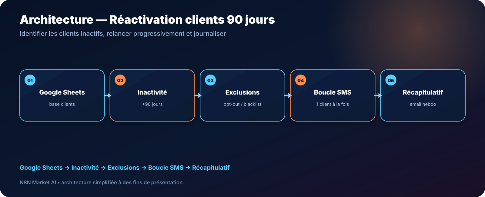

# Relance SMS automatique des clients inactifs 90 jours — n8n

> **Un workflow pour repérer les clients sans rendez-vous récent, appliquer les exclusions puis envoyer des SMS de réactivation de façon contrôlée.**

[**🛠️ Commander une version personnalisée — 29 € →**](https://n8nmarketai.com/products/relance-sms-automatique-clients-inactifs-90-jours-workflow-n8n)

## 🛒 Offre N8N Market AI

| | |
|---|---|
| 💰 **Prix** | **29 €** |
| 📌 **Statut** | **🟠 BETA / PERSONNALISATION** |
| 📦 **Livraison** | Finalisation + validation avant livraison |
| 🧩 **Niveau** | Intermédiaire |
| ⏱️ **Installation estimée** | 20–45 min* |
| 🔧 **Personnalisation** | Disponible |

*Estimation hors récupération, création ou validation des accès externes.

---

## Pourquoi ce produit ?

Les clients inactifs peuvent disparaître de la relation commerciale sans que le salon s’en rende compte. Une routine simple permet de préparer des relances régulières.

Il vise à :
- détecter l’inactivité ;
- exclure les clients à ne pas contacter ;
- envoyer les SMS un par un ;
- éviter un envoi massif instantané ;
- produire un récapitulatif.

## Pour qui ?

- salons de coiffure ;
- barbiers ;
- instituts ;
- commerces avec base clients dans Sheets ;
- structures utilisant Twilio ou un fournisseur SMS compatible.

## Avant / Après

| Avant | Avec le workflow |
|---|---|
| Chercher les anciens clients à la main | Détection selon la dernière visite |
| Risque de contacter un client exclu | Liste d’exclusion |
| Envoi manuel | Boucle SMS contrôlée |
| Pas de synthèse | Récapitulatif hebdomadaire |
| Données dispersées | Suivi dans Sheets |

## Architecture

**Google Sheets → Inactivité → Exclusions → Boucle SMS → Récapitulatif**

## Fonctionnement cible

1. Lire la base clients.
2. Calculer le temps depuis la dernière visite.
3. Exclure les clients non éligibles.
4. Traiter chaque client individuellement.
5. Envoyer le SMS.
6. Produire un récapitulatif.

## Cas d'usage

### Salon
Réactiver les clients absents depuis plusieurs mois.

### Barbier
Créer une campagne hebdomadaire légère.

### Institut
Adapter le délai d’inactivité à son cycle de visite.

## ⚠️ À finaliser avant livraison

- fournir un modèle Google Sheets complet ;
- ajouter une boucle explicite pour traiter chaque SMS séparément ;
- mettre en place une liste d’exclusion/opt-out robuste ;
- définir le suivi après réponse ou nouveau rendez-vous ;
- tester la cadence d’envoi.

## Limites

- ne sait pas automatiquement si le client a réservé après le SMS sans intégration supplémentaire ;
- pas de logiciel de réservation connecté par défaut ;
- les données doivent être à jour ;
- les SMS sont facturés par le fournisseur.

## 🛡️ Garde-fous recommandés

- liste noire/opt-out ;
- limite de fréquence ;
- pause entre messages ;
- journalisation ;
- aucun envoi aux numéros invalides.

## 📦 Ce que vous recevez

Après finalisation :
- workflow finalisé ;
- modèle Google Sheets ;
- règles d’inactivité personnalisables ;
- templates SMS ;
- guide Twilio ;
- récapitulatif email.

> Le fichier JSON commercial complet, les clés API et les credentials clients ne sont pas publiés dans ce dépôt.

## Prérequis

- n8n ;
- Google Sheets ;
- fournisseur SMS compatible ;
- email si le récapitulatif est conservé.

## FAQ

### Le délai doit-il être exactement 90 jours ?
Non. Il est personnalisable.

### Le workflow sait-il si le client a réservé ensuite ?
Pas sans connexion supplémentaire au système de réservation.

### Peut-on gérer les désabonnements ?
Oui, la version finale doit intégrer une liste d’exclusion.

### Les SMS partent-ils tous en même temps ?
La version finale prévoit un traitement en boucle pour mieux contrôler la cadence.

---

## Réactivez vos anciens clients avec une routine simple et contrôlée

[**🛠️ Commander la version personnalisée — 29 € →**](https://n8nmarketai.com/products/relance-sms-automatique-clients-inactifs-90-jours-workflow-n8n)

[← Retour au catalogue N8N Market AI](../../README.md)
